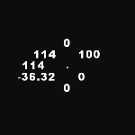
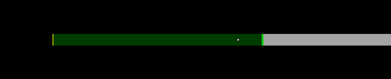
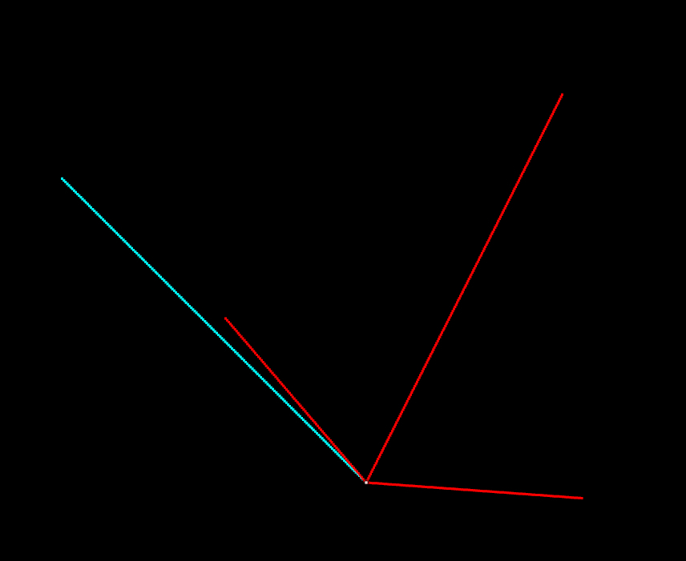
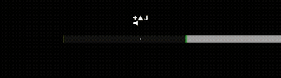
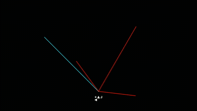
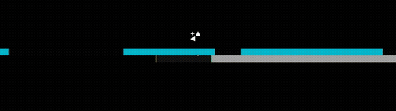
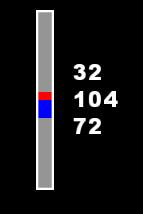
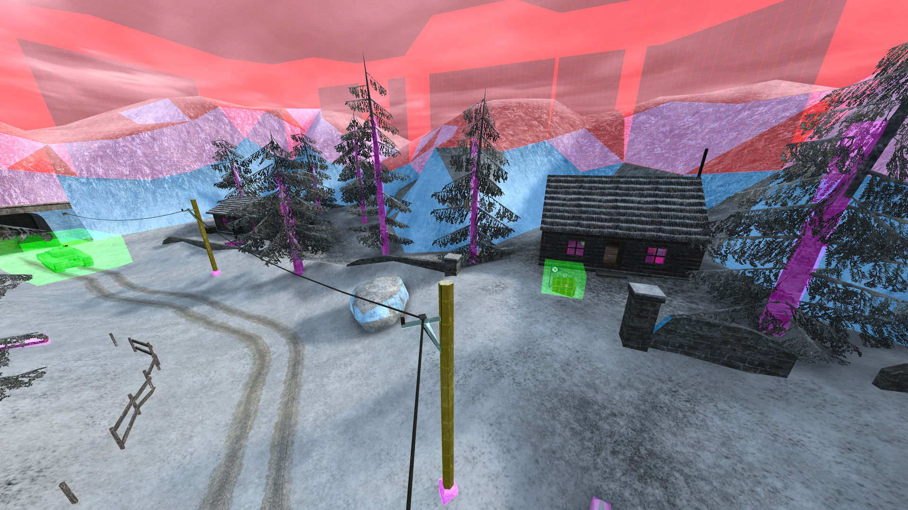

# Advanced features

This page contains an introduction to some of the more advanced features in ETJump, and some more in-depth information on certain movement mechanics.


```{admonition} Under construction
:class: seealso

This page is a work in progress. The old "Getting Started" page was split into three separate pages without much of new content. This will be filled with more information in the future.
```

---

## Overbounces and the overbounce detector

```{admonition} What is an overbounce?
:class: seealso
Overbounce is a bug that originates from Quake III Arena. When an overbounce happens, instead of clipping your velocity when landing on ground, the game instead projects all the velocity to a different direction based on your movement input and horizontal velocity. This allows players to retain their velocity and project it to another direction when landing on a surface.
```

Overbounce detector shows you if you can overbounce from the surface you're currently aiming at. The detector can display whether you need to jump or fall to the surface, to perform an overbounce. It can be enabled with the [`etj_drawOB`](client/etjump_cvars.md/#etj_drawob) cvar.

* **F** will be shown if you need to **Fall** onto the surface
* **J** will be shown if you need to **Jump** onto the surface

It is also possible to display "sticky" overbounces by setting `etj_drawOB` value to **2**. Sticky overbounces are just like regular overbounces, except they require your starting position to be slightly (< 0.25u) off the ground. The game does always place you exactly on top of a ground plane, but instead sometimes places you hovering ever so slightly off the ground. Sticky overbounces detect this - if you see an **S** along with **F** and/or **J** on the overbounce detector, that means you can perform an overbounce on the surface by managing to set your current position slightly off the ground. Once you manage to do that, the **S** symbol disappears and you should just see the regular **F** and/or **J** symbol.

Performing an overbounce does not require anything special, it happens "automatically". However, many maps that employ overbounce tricks require you to manipulate your velocity and inputs such that most of the velocity is getting projected up. This is usually performed by jumping to a corner (to nullify horizontal velocity) and pressing `+strafe` and moving the mouse very slowly to gain a fraction of a unit of speed to the direction of the mouse movement. The speed of the movement determines how much of the velocity is being projected up vs horizontally - with slower movement, more velocity is being projected up rather than horizontally.

```{tip}
* Movement "sensitivity" when holding `+strafe` is controlled by the cvars `m_forward` and `m_side`
* Most players prefer to use `m_side 0` to only allow performing overbounces directly forwards or backwards
* These sensitivity values are framerate dependant - `m_forward 0.25` is twice as sensitive on **250FPS** compared to **125FPS**.
```

An overbounce cannot be performed if the user has exactly **0ups** horizontal speed, hence we must apply a miniscule amount of speed using `+strafe`. An exception to this are overbounces performed from water, which work by either proning or crouching, depending on how deep the water is.

```{note}
To learn more about overbounces and what causes it to happen, watch [this excellent video](https://www.youtube.com/watch?v=WmO2cdTU7EM) by Matt's Ramblings.
```

---

## CHS
CHS, or crosshair stats, is a feature that lets you display various statistics either around your crosshair, or as a separate list.

* [`etj_drawCHS1`](client/etjump_cvars.md/#etj_drawchs1), displays around your crosshair



* [`etj_drawCHS2`](client/etjump_cvars.md/#etj_drawchs2), displays as a list.


```{tip}
You can make the text on `etj_drawCHS2` right-aligned by setting the value to **2**.
```

Each position has 8 configurable cvars, that lets you pick the stat displayed on the corresponding position.

* [`etj_CHS1Info1-8`](client/etjump_cvars.md/#etj_chs1info1-8) for CHS 1
* [`etj_CHS2Info1-8`](client/etjump_cvars.md/#etj_chs2info1-8) for CHS 1

The table below displays the possible values for each info position.

Value      | Stat displayed
:----------|:--------------
1          | player's speed
2          | player's health
4          | player's ammo for currently selected weapon
10         | horizontal distance to plane
11         | vertical distance to plane
12         | true distance to plane
13         | true distance to plane from view point
14         | horizontal/vertical/true distance to plane
15         | horizontal/vertical/true(view) distance to plane
16         | world x y z location of plane
20         | speed along world x axis
21         | speed along world y axis
22         | speed along world z axis
23         | horizontal speed
24         | true speed
25         | speed relative to forward
26         | speed relative to side
27         | speed relative to forward/side
28         | horizontal speed/speed relative to forward/side
30         | player's pitch
31         | player's yaw
32         | player's roll
33         | player's X position
34         | player's Y position
35         | player's Z position
36         | view X position
37         | view Y position
38         | view Z position
40         | player's pitch/yaw
41         | player's position in the world
42         | player's position in the world and pitch/yaw
43         | view position in the world and pitch/yaw
44         | position x y z
45         | view position x y z
46         | angles x y z
47         | velocity x y z
50         | jump x y z
53         | plane angle z
55         | last jump speed

```{tip}
You can see this list in-game with the [`chs`](client/client_commands.md/#chs) command.
```

---

## CGaz HUD
CGaz HUD is a tool that helps you find the correct angles required for accelerating. It can be enabled with the [`etj_drawCGaz`](client/etjump_cvars.md/#etj_drawcgaz) cvar. There are two different HUD types available. These can be a bit hard to understand initially and require some practice, but are well worth getting into if you are serious about improving your strafing skills.

* `etj_drawCGaz1`



* `etj_drawCGaz2`



### etj_drawCGaz 1

The goal is to keep the crosshair close to the green line, but not let it touch it - if that happens, no acceleration occurs until the player adjusts their angle.



```{note}
`etj_drawCGaz 1` comes originally from the Quake III DeFRaG mod. With it's CPM physics mode, the dark green zone and yellow line are important parts of reading the HUD, but in ET, these are not important. They are only included for familiarity for people who might play both of the mods. In ET, the only important part of the CGaz 1 HUD is the minimum angle line.
```

### etj_drawCGaz 2

The goal is to keep the gap between the red side lines and the cyan line as small as possible, but never let them overlap - if that happens, no acceleration occurs until the player adjusts their angle.



```{tip}
`etj_drawCGaz` is a bitflag cvar - you can display both of the HUDs at the same time if you wish.
```

Both HUDs have extensive customization options.

```{admonition} etj_drawCGaz 1
:class: seealso

* [`etj_CGaz1Color1`](client/etjump_cvars.md#etj_cgaz1color1)
* [`etj_CGaz1Color2`](client/etjump_cvars.md#etj_cgaz1color2)
* [`etj_CGaz1Color3`](client/etjump_cvars.md#etj_cgaz1color3)
* [`etj_CGaz1Color4`](client/etjump_cvars.md#etj_cgaz1color4)
* [`etj_CGaz1DrawSnapZone`](client/etjump_cvars.md#etj_cgaz1drawsnapzone)
* [`etj_CGazFov`](client/etjump_cvars.md#etj_cgazfov)
* [`etj_CGazHeight`](client/etjump_cvars.md#etj_cgazheight)
* [`etj_CGazOnTop`](client/etjump_cvars.md/#etj_cgazontop)
* [`etj_CGazTrueness`](client/etjump_cvars.md#etj_cgaztrueness)
```

```{admonition} etj_drawCGaz 2
:class: seealso

* [`etj_CGaz2Color1`](client/etjump_cvars.md/#etj_cgaz2color1)
* [`etj_CGaz2Color2`](client/etjump_cvars.md/#etj_cgaz2color2)
* [`etj_CGaz2FixedSpeed`](client/etjump_cvars.md/#etj_cgaz2fixedspeed)
* [`etj_CGaz2NoVelocityDir`](client/etjump_cvars.md/#etj_cgaz2novelocitydir)
* [`etj_CGaz2WishDirFixedSpeed`](client/etjump_cvars.md/#etj_cgaz2wishdirfixedspeed)
* [`etj_CGaz2WishDirUniformLength`](client/etjump_cvars.md/#etj_cgaz2wishdiruniformlength)
* [`etj_CGazTrueness`](client/etjump_cvars.md/#etj_cgaztrueness)
* [`etj_stretchCgaz`](client/etjump_cvars.md/#etj_stretchcgaz)
```

The CGaz HUD alone is not able to fully visualize how acceleration behaves. For the whole picture, we also need to inspect velocity snapping zones with the [Snaphud](advanced_features.md/#velocity-snapping-hud).

---

## Velocity Snapping HUD

Velocity snapping HUD can be enabled with the cvar `etj_drawSnapHUD`. It lets you see the zones at which all acceleration is snapped to the same value/direction. This tool should be combined with [etj_drawCGaz](client/etjump_cvars.md/#etj_drawcgaz), to visualize the correct yaw angle for acceleration to occur.

The snaphud is conceptually simple. By keeping your crosshair in between the border of the current snapzone, and the CGaz minimum line, acceleration is maximized. The exact positioning of your crosshair doesn't matter, as long as the "in between" condition is met. The amount of acceleration gained depends on how small the gap between minimum CGaz line and edge of a snapzone is: the smaller the gap, the higher the acceleration.


```{tip}
Don't be confused by the coloring of the snaphud - both the colored and uncolored zones are considered snapzones. The positions at which the color changes simply indicates a yaw angle where the direction of the velocity snapping changes.
```

Because the exact position of your crosshair does not matter, you will often see more skilled players simply placing their crosshair to the end of the current snapzone. This greatly reduces the precision required to maintain maximum acceleration, as opposed to constantly adjusting your angle to follow the minimum CGaz HUD line.



The snaphud can be customized with the following cvars.

* [`etj_snapHUDActiveIsPrimary`](client/etjump_cvars.md/#etj_snaphudactiveisprimary)
* [`etj_snapHUDColor1`](client/etjump_cvars.md/#etj_snaphudcolor1)
* [`etj_snapHUDColor2`](client/etjump_cvars.md/#etj_snaphudcolor2)
* [`etj_snapHUDEdgeThickness`](client/etjump_cvars.md/#etj_snaphudedgethickness)
* [`etj_snapHUDFov`](client/etjump_cvars.md/#etj_snaphudfov)
* [`etj_snapHUDHeight`](client/etjump_cvars.md/#etj_snaphudheight)
* [`etj_snapHUDHLActive`](client/etjump_cvars.md/#etj_snaphudhlactive)
* [`etj_snapHUDHLColor1`](client/etjump_cvars.md/#etj_snaphudhlcolor1)
* [`etj_snapHUDHLColor2`](client/etjump_cvars.md/#etj_snaphudhlcolor2)
* [`etj_snapHUDOffsetY`](client/etjump_cvars.md/#etj_snaphudoffsety)
* [`etj_snapHUDTrueness`](client/etjump_cvars.md/#etj_snaphudtrueness)

---

## Upmove meter

Upmove meter can be enabled with the cvar [`etj_drawUpmoveMeter`](client/etjump_cvars.md/#etj_drawupmovemeter). It displays a graph (**1**) and/or text (**2**) representation of `+moveup` times while jumping, or amount of time spend on ground. This can be a very useful tool for monitoring your jump timings - every [physics frame](getting_started.md/#framerate-independent-physics) spent holding down `+moveup` has a reduced acceleration!



* Time `+moveup` was held after jumping (top element)
* Total time `+moveup` was held (middle element)
* Time spend on ground OR time `+moveup` was held before landing (bottom element)

```{note}
Because servers run at `sv_fps 20`, this is only fully accurate while playing. It's not possible to approximate the jump timings precisely while spectating or playing back demos, because user commands are received at **50ms** intervals instead of __8ms__. Spectating someone or playing a demo will display a rough approximation.
```

The upmove meter has extensive customization.

* [etj_upmoveMeterGraphColor](client/etjump_cvars.md#etj_upmovemetergraphcolor)
* [etj_upmoveMeterGraphH](client/etjump_cvars.md#etj_upmovemetergraphh)
* [etj_upmoveMeterGraphOnGroundColor](client/etjump_cvars.md#etj_upmovemetergraphongroundcolor)
* [etj_upmoveMeterGraphOutlineColor](client/etjump_cvars.md#etj_upmovemetergraphoutlinecolor)
* [etj_upmoveMeterGraphOutlineW](client/etjump_cvars.md#etj_upmovemetergraphoutlinew)
* [etj_upmoveMeterGraphPostJumpColor](client/etjump_cvars.md#etj_upmovemetergraphpostjumpcolor)
* [etj_upmoveMeterGraphPreJumpColor](client/etjump_cvars.md#etj_upmovemetergraphprejumpcolor)
* [etj_upmoveMeterGraphW](client/etjump_cvars.md#etj_upmovemetergraphw)
* [etj_upmoveMeterGraphX](client/etjump_cvars.md#etj_upmovemetergraphx)
* [etj_upmoveMeterGraphY](client/etjump_cvars.md#etj_upmovemetergraphy)
* [etj_upmoveMeterMaxDelay](client/etjump_cvars.md#etj_upmovemetermaxdelay)
* [etj_upmoveMeterTextColor](client/etjump_cvars.md#etj_upmovemetertextcolor)
* [etj_upmoveMeterTextH](client/etjump_cvars.md#etj_upmovemetertexth) 
* [etj_upmoveMeterTextShadow](client/etjump_cvars.md#etj_upmovemetertextshadow)
* [etj_upmoveMeterTextSize](client/etjump_cvars.md#etj_upmovemetertextsize)
* [etj_upmoveMeterTextX](client/etjump_cvars.md#etj_upmovemetertextx)

## Clip, Trigger & Slick drawing

[ETe engine](https://github.com/etfdevs/ETe) includes a basic support for drawing clip brushes, trigger brushes and slick surfaces. ETJump offers cvar unlockers for these features with the cvars `etj_drawClips`, `etj_drawTriggers` and `etj_drawSlicks`.



This will draw any clip brushes (both playerclips and weaponclips, with different color variations per clip type), trigger brushes and slick surfaces. The system is not perfect: it will hit renderer limits very quickly on maps with lots of geometry, breaks when certain types of renderer elements are on screen (for example skyportals and __HUD player head__), and has no awarness of gamestate, meaning any brush that is placed onto it's correct position or moved around during gamestate will be static and might appear in a wrong position.

The shaders used for drawing are constructed in place by ETe. They can however be customized with the following cvars:

* `r_drawClipsShader`
* `r_drawTriggersShader`
* `r_drawClipsShader`

ETJump provides some additional shaders that can be used for drawing. Note that using these shaders for `r_drawClipsShader` will disable the distinction between different clip types.

### `tcRenderShader_nocull`
   * Identical to the built-in shader used by ETe, except it will disable culling on the shader, so looking at a clip brush for example will also draw the other side of the brush. 
### `tcRenderShader<1|2|3><r|g|b|y|m|c>`
  * Allows setting __3__ different transparency levels, __1__ being most opaque (equivalent to the built-in shader), as well as __6__ different colors (red, green, blue, yellow, magenta, cyan). For example, `tcRenderShader2c` would be a medium tranparency (__2__) shader with cyan (__c__) color.

Note that since this feature is built into ETe engine and we merely provide cvar unlockers, ETJump has no real control over it's development. Keep an eye out for ETe updates for possible improvements and fixes!
