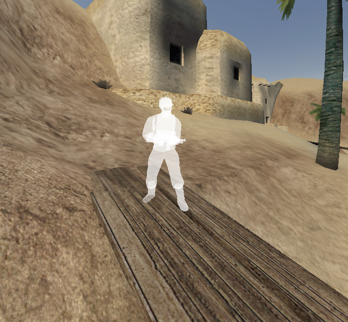

# List of ETJump client cvars
Below is a list of all ETJump related cvars (console variables) available for players.

---

## b_demo_lookat
Cvar                    | Values        | Default
:-----------------------|:--------------|:------------
b_demo_lookat           | -1 - 1024     | -1

Specifies an entity to focus freecam at on demo playback. **-1** disables focus.

```{note}
This cvar shares it's name with the equivalent ETPro cvar for compatibility with Camtrace 3D scripts.
```

---

## etj_accelAlign
Cvar                    | Values        | Default
:-----------------------|:--------------|:------------
etj_accelAlign          | 0 - 2         | 0

Sets the alignment of the acceleration meter.

* **0** Center
* **1** Left align
* **2** Right align

---

## etj_accelAlpha
Cvar                    | Values        | Default
:-----------------------|:--------------|:------------
etj_accelAlpha          | 0.0 - 1.0     | 1.0

Sets the alpha of the acceleration meter.

---

## etj_accelColor
Cvar                    | Values                                | Default
------------------------|:-------------------------------------:|-------------
etj_accelColor          | [any color](../index.md#color-system) | white

Sets the color of the acceleration meter.

```{note}
Use [`etj_accelAlpha`](etjump_cvars.md/#etj_accelalpha) to set alpha.
```

---

## etj_accelColorUsesAccel
Cvar                    | Values        | Default
:-----------------------|:--------------|:------------
etj_accelColorUsesAccel | 0 - 2         | 0

Changes the acceleration meter color to represent acceleration or deceleration.

* **1** simple, green if accelerating, red if decelerating, white if no input
* **2** advanced, takes into account per vector acceleration and current movement direction
    * green - optimal acceleration
    * yellow - suboptimal acceleration relative to movement direction
    * red - no acceleration towards movement direction
    * white - no input

```{note}
Due to inaccuracies in interpolation, advanced coloring is automatically disabled while spectating and during demo playback, and simple acceleration coloring is used instead.
```

---

## etj_accelShadow
Cvar                    | Values        | Default
:-----------------------|:--------------|:------------
etj_accelShadow         | 0 or 1        | 1

Toggles shadow on the acceleration meter.

---

## etj_accelSize
Cvar                    | Values        | Default
:-----------------------|:--------------|:------------
etj_accelSize           | any value     | 3

Sets the size of the acceleration meter.

---

## etj_accelX
Cvar                    | Values        | Default
:-----------------------|:--------------|:------------
etj_accelSize           | any value     | 320

Sets the horizontal position of the acceleration meter.

---

## etj_accelY
Cvar                    | Values        | Default
:-----------------------|:--------------|:------------
etj_accelSize           | any value     | 340

Sets the vertical position of the acceleration meter.

---

## etj_ad_savePBOnly
Cvar                    | Values        | Default
:-----------------------|:--------------|:------------
etj_ad_savePBOnly       | 0 or 1        | 0

Toggles whether [`etj_autodemo`](etjump_cvars.md/#etj_autodemo) saves all timerun demos, or only new personal bests.

---

## etj_ad_stopDelay
Cvar                    | Values        | Default
:-----------------------|:--------------|:------------
etj_ad_stopDelay        | 0 - 10000     | 2000

Time in milliseconds to delay the stopping and saving of autodemo when a timerun ends.

---

## etj_ad_targetPath
Cvar                    | Values        | Default
:-----------------------|:--------------|:------------
etj_ad_targetPath       | any string    | autodemo

Folder inside `demos` folder to store saved autodemo recordings in.

---

## etj_altScoreboard
Cvar                    | Values        | Default
:-----------------------|:--------------|:------------
etj_altScoreboard       | 0 - 3         | 0

Changes the scoreboard to an alternative one.  

* **0** default ETMain styled scoreboard.
* **1** and **2** draw alternatively styled scoreboard.
* **3** draws a compact scoreboard with dynamic size and position adjustments.

---

## etj_autoDemo
Cvar                    | Values        | Default
:-----------------------|:--------------|:------------
etj_autoDemo            | 0 - 2         | 0

Automatically start recording a demo whenever player loads (unless a timerun is active) or spawns.

* **1** enabled only for maps with a timerun.
* **2** enabled for all maps.

```{note}
Autodemo records a circular buffer of 20 demos, located in `demos/temp`. The naming starts from `temp_01.dm_84` and progresses to `temp_20.dm_84`, after which it starts overwriting demos starting again from `temp_01.dm_84`.
```

---

## etj_autoLoad
Cvar                    | Values        | Default
:-----------------------|:--------------|:------------
etj_autoLoad            | 0 or 1        | 1

Automatically load into last saved position when joining a team.

---

## etj_autoPortalBinds
Cvar                    | Values        | Default
:-----------------------|:--------------|:------------
etj_autoPortalBinds     | 0 or 1        | 1

Automatically bind `+attack2` to current `weapalt` key and back when equipping/unequipping portal gun.

```{note}
Switching to spectators will also adjust the bindings in order to preserve `followprev` functionality of `weapalt`.
```

---

## etj_CGaz1Color1
Cvar                    | Values        | Default
:-----------------------|:--------------|:------------
etj_CGaz1Color1         | [any color](../index.md#color-system) | 0.75 0.75 0.75 0.75

Sets color of the no accel zone in CGaz HUD **1**.

---

## etj_CGaz1Color2
Cvar                    | Values        | Default
:-----------------------|:--------------|:------------
etj_CGaz1Color2         | [any color](../index.md#color-system) | 0.0 1.0 0.0 0.75

Sets color of the minimum angle in CGaz HUD **1**.

---

## etj_CGaz1Color3
Cvar                    | Values        | Default
:-----------------------|:--------------|:------------
etj_CGaz1Color3         | [any color](../index.md#color-system) | 0.0 0.2 0.0 0.75

Sets color of the accel zone in CGaz HUD **1**.

---

## etj_CGaz1Color4
Cvar                    | Values        | Default
:-----------------------|:--------------|:------------
etj_CGaz1Color4         | [any color](../index.md#color-system) | 1.0 1.0 0.0 0.75

Sets color of the max angle in CGaz HUD **1**.

---

## etj_CGaz1DrawSnapZone
Cvar                    | Values        | Default
:-----------------------|:--------------|:------------
etj_CGaz1DrawSnapZone   | 0 or 1        | 0

Extends minline drawing on CGaz 1 to the end of the current snap zone.

```{note}
This uses [`etj_CGazFov`](etjump_cvars.md/#etj_cgazfov) to determine the snapzone positions. It's meant to be used standalone, without using [`etj_drawSnapHUD`](etjump_cvars.md/#etj_drawsnaphud). If CGaz and snaphud FOVs do not match, the drawing appears misaligned compared to the snaphud, though it is still correct.
```

---

## etj_CGaz2Color1
Cvar                    | Values        | Default
:-----------------------|:--------------|:------------
etj_CGaz2Color1          | [any color](../index.md#color-system) | 1.0 0.0 0.0 1.0

Sets primary color of CGaz HUD **2**.

---

## etj_CGaz2Color2
Cvar                    | Values        | Default
:-----------------------|:--------------|:------------
etj_CGaz2Color2          | [any color](../index.md#color-system) | 0.0 1.0 1.0 1.0

Sets secondary color of CGaz HUD **2**.

---

## etj_CGaz2FixedSpeed
Cvar                    | Values             | Default
------------------------|:-------------------|-------------
etj_CGaz2FixedSpeed     | any positive value | 0

When set to higher than **0**, CGaz 2 will be drawn as if the player had the set amount of speed, instead of being adjusted by players real speed.

---

## etj_CGaz2NoVelocityDir
Cvar                    | Values        | Default
:-----------------------|:--------------|:------------
etj_CGaz2NoVelocityDir  | 0 - 2         | 0

Controls drawing of velocity direction line on CGaz 2.

* **1** never draw velocity direction line
* **2** draw only while under wishspeed

---

## etj_CGaz2WishDirFixedSpeed
Cvar                       | Values             | Default
---------------------------|:-------------------|-------------
etj_CGaz2WishDirFixedSpeed | any positive value | 0

When set to higher than **0**, CGaz 2 wishdir line length will be scaled to match player speed, similar to [`etj_CGaz2FixedSpeed`](#etj_cgaz2fixedspeed).

---

## etj_CGaz2WishDirUniformLength
Cvar                          | Values             | Default
------------------------------|:-------------------|-------------
etj_CGaz2WishDirUniformLength | 0 or 1             | 0

If set, CGaz2 wishdir line will be uniformly scaled regardless of player inputs (e.g. `+forward` & `+moveright` length is same as just `+forward`).

---

## etj_CGazFov
Cvar                    | Values        | Default
:-----------------------|:--------------|:------------
etj_CGazFov             | 0 - 179       | 0

Sets FOV of CGaz HUD **1**. Value **0** uses your current in-game FOV.

---

## etj_CGazHeight
Cvar                    | Values        | Default
:-----------------------|:--------------|:------------
etj_CGazHeight          | any integer   | 20

Sets height of CGaz HUD **1**.

---

## etj_CGazOnTop
Cvar                    | Values        | Default
:-----------------------|:--------------|:------------
etj_CGazOnTop           | 0 or 1        | 0

Toggles drawing of CGaz HUD on top of Snaphud.

---

## etj_CGazTrueness
Cvar                    | Values        | Default
:-----------------------|:--------------|:------------
etj_CGazTrueness        | bitflag       | 2

Sets "trueness" flags on CGaz HUD.

* **1** show upmove influence
* **2** show true groundzones (CGaz 1 only)

---

## etj_CGazY
Cvar                    | Values        | Default
:-----------------------|:--------------|:------------
etj_CGazY               | any integer   | 240

Sets vertical position of CGaz HUD **1**.

---

## etj_chatAlpha
Cvar                    | Values        | Default
:-----------------------|:--------------|:------------
etj_chatAlpha           | 0.0 - 1.0     | 1.0

Sets alpha for chat messages.

---

## etj_chatBackgroundAlpha
Cvar                    | Values        | Default
:-----------------------|:--------------|:------------
etj_chatBackgroundAlpha | 0.0 - 1.0     | 0.33

Sets alpha for the chat background gradient.

---

## etj_chatFlags
Cvar                    | Values        | Default
:-----------------------|:--------------|:------------
etj_chatFlags           | 0 or 1        | 1

Toggles drawing of team flags on chat messages.

---

## etj_chatLineWidth
Cvar                    | Values        | Default
:-----------------------|:--------------|:------------
etj_chatLineWidth       | 1 - 200       | 62

Sets number of characters on one line of chat before a linebreak happens.

---

## etj_chatPosX
Cvar                    | Values        | Default
:-----------------------|:--------------|:------------
etj_chatPosX            | any integer   | 0

Sets horizontal offset of the chat.

---

## etj_chatPosY
Cvar                    | Values        | Default
:-----------------------|:--------------|:------------
etj_chatPosY            | any integer   | 0

Sets vertical offset of the chat.

---

## etj_chatScale
Cvar                    | Values        | Default
:-----------------------|:--------------|:------------
etj_chatScale           | any value     | 1.0

Scales the chat size.

---

## etj_chatShadow
Cvar                    | Values        | Default
:-----------------------|:--------------|:------------
etj_chatShadow          | 0 or 1        | 0

Toggles shadow on chat messages.

---

## etj_checkpointsCount
Cvar                    | Values        | Default
:-----------------------|:--------------|:------------
etj_checkpointsCount    | 1-5           | 3

How many checkpoints timers to draw.

---

## etj_checkpointsPopup
Cvar                    | Values        | Default
:-----------------------|:--------------|:------------
etj_checkpointsPopup    | 0 or 1        | 1

Toggles checkpoint popup on screen when hitting a checkpoint.

```{tip}
This functions independently of [`etj_drawCheckpoints`](etjump_cvars.md/#etj_drawcheckpoints).
```

---

## etj_checkpointsPopupDuration
Cvar                         | Values        | Default
-----------------------------|:--------------|-------------
etj_checkpointsPopupDuration | any integer   | 1000

How long in milliseconds a checkpoint popup stays on screen.

---

## etj_checkpointsPopupSize
Cvar                     | Values        | Default
-------------------------|:--------------|-------------
etj_checkpointsPopupSize | any value     | 2

Sets size of a checkpoint popup.

---

## etj_checkpointsPopupShadow
Cvar                       | Values        | Default
---------------------------|:--------------|-------------
etj_checkpointsPopupShadow | 0 or 1        | 1

Toggles drawing shadow on checkpoint popups.

---

## etj_checkpointsPopupX
Cvar                    | Values        | Default
:-----------------------|:--------------|:------------
etj_checkpointsPopupX   | any value     | 320

Sets horizontal position of a checkpoint popup.

---

## etj_checkpointsPopupY
Cvar                    | Values        | Default
:-----------------------|:--------------|:------------
etj_checkpointsPopupY   | any value     | 200

Sets vertical position of a checkpoint popup.

---

## etj_checkpointsShadow
Cvar                    | Values        | Default
:-----------------------|:--------------|:------------
etj_checkpointsShadow   | 0 or 1        | 1

Toggles shadow on the checkpoint timer.

---

## etj_checkpointsSize
Cvar                    | Values        | Default
:-----------------------|:--------------|:------------
etj_checkpointsSize     | any value     | 2

Sets size of the checkpoint timer.

---

## etj_checkpointsStyle
Cvar                    | Values        | Default
:-----------------------|:--------------|:------------
etj_checkpointsStyle    | 0 or 1        | 0

Sets style of the checkpoint timer.

* **0** relative time
* **1** absolute time

```{note}
If you have not previously set a record on the current timerun, or haven't [loaded checkpoints for comparison](client_commands.md/#loadcheckpoints), absolute time is always displayed.
```

---

## etj_checkpointsX
Cvar                    | Values        | Default
:-----------------------|:--------------|:------------
etj_checkpointsSizeX    | any value     | 320

Sets horizontal position of the checkpoint timer.

```{note}
Checkpoint timer must be in detached mode (`etj_drawCheckpoints 2`) to adjust the position.
```

---

## etj_checkpointsY
Cvar                    | Values        | Default
:-----------------------|:--------------|:------------
etj_checkpointsSizeY    | any value     | 380

Sets vertical position of the checkpoint timer.

```{note}
Checkpoint timer must be in detached mode (`etj_drawCheckpoints 2`) to adjust the position.
```

---

## etj_CHS1Info1-8
Cvar                    | Values        | Default
:-----------------------|:--------------|:------------
etj_CHS1Info1-8         | [chs info value](../index.md/#chs) | 0

Sets CHS **1** info of the given slot to display the given info value.

---

## etj_CHS2Info1-8
Cvar                    | Values        | Default
:-----------------------|:--------------|:------------
etj_CHS2Info1-8         | [chs info value](../index.md/#chs) | 0

Sets CHS **2** info of the given slot to display the given info value.

---

## etj_CHS2PosX
Cvar                    | Values        | Default
:-----------------------|:--------------|:------------
etj_CHS2PosX            | any integer   | 0

Sets horizontal offset of CHS2.

---

## etj_CHS2PosY
Cvar                    | Values        | Default
:-----------------------|:--------------|:------------
etj_CHS2PosY            | any integer   | 0

Sets vertical offset of CHS2.

---

## etj_CHSAlpha
Cvar                    | Values        | Default
:-----------------------|:--------------|:------------
etj_CHSAlpha            | 0.0 - 1.0     | 1.0

Sets alpha of the CHS.

---

## etj_CHSColor
Cvar                    | Values        | Default
:-----------------------|:--------------|:------------
etj_CHSColor            | [any color](../index.md#color-system) | 1.0 1.0 1.0

Sets the color of CHS.

```{note}
Alpha is controlled by [`etj_CHSAlpha`](etjump_cvars.md/#etj_chsalpha).
```

---

## etj_CHSShadow
Cvar                    | Values        | Default
:-----------------------|:--------------|:------------
etj_CHSShadow           | 0 or 1        | 0

Toggles shadow on CHS.

---

## etj_CHSUseFeet
Cvar                    | Values        | Default
:-----------------------|:--------------|:------------
etj_CHSUseFeet          | 0 or 1        | 0

Toggles shifting z-origin used by CHS to feet level for positional calculations.

---

## etj_clear
Cvar                    | Values        | Default
:-----------------------|:--------------|:------------
etj_clear               | 0 or 1        | 0

Force screen clear with pink color when drawing void.

```{hint}
This is a cvar unlocker for `r_clear`.
```

---

## etj_consoleAlpha
Cvar                    | Values        | Default
:-----------------------|:--------------|:------------
etj_consoleAlpha        | 0.0 - 1.0     | 1.0

Sets alpha of the console.

---

## etj_consoleColor
Cvar                    | Values        | Default
:-----------------------|:--------------|:------------
etj_consoleColor        | [any color](../index.md#color-system) | 0.0 0.0 0.0

Sets the console background color when [`etj_consoleShader`](etjump_cvars.md/#etj_consoleshader) is set to **0**.

---

## etj_consoleShader
Cvar                    | Values        | Default
:-----------------------|:--------------|:------------
etj_consoleShader       | 0 or 1        | 1

Toggles console background shader.

---

## etj_crosshairOutline
Cvar                    | Values        | Default
:-----------------------|:--------------|:------------
etj_crosshairOutline    | 0 or 1        | 1

Toggles drawing of outline on ETJump crosshairs.

---

## etj_crosshairScaleX
Cvar                    | Values        | Default
:-----------------------|:--------------|:------------
etj_crosshairScaleX     | -5 - 5        | 1.0

Sets the horizontal scaling of the crosshair.

```{tip}
This works on all crosshairs, not just the ETJump-exclusive crosshairs.
```

---

## etj_crosshairScaleY
Cvar                    | Values        | Default
:-----------------------|:--------------|:------------
etj_crosshairScaleY     | -5 - 5        | 1.0

Sets the vertical scaling of the crosshair.

```{tip}
This works on all crosshairs, not just the ETJump-exclusive crosshairs.
```

---

## etj_crosshairThickness
Cvar                    | Values        | Default
:-----------------------|:--------------|:------------
etj_crosshairThickness  | 0 - 5         | 1.0

Sets the line thickness of ETJump crosshairs.

---

## etj_demo_freecamspeed
Cvar                    | Values        | Default
:-----------------------|:--------------|:------------
etj_demo_freecamspeed   | any integer   | 800

Sets freecam movement speed in demo playback.

---

## etj_demo_pitchturnspeed
Cvar                    | Values        | Default
:-----------------------|:--------------|:------------
etj_demo_pitchturnspeed | any integer   | 140

Sets freecam `PITCH` turn speed in demo playback.

---

## etj_demo_rollspeed
Cvar                    | Values        | Default
:-----------------------|:--------------|:------------
etj_demo_rollspeed      | any integer   | 140

Sets freecam `ROLL` turn speed in demo playback.

---

## etj_demo_yawturnspeed
Cvar                    | Values        | Default
:-----------------------|:--------------|:------------
etj_demo_yawturnspeed   | any integer   | 140

Sets freecam `YAW` turn speed in demo playback.

---

## etj_drawAccel
Cvar                    | Values        | Default
:-----------------------|:--------------|:------------
etj_drawAccel           | 0 or 1        | 0

Toggles drawing of acceleration values on x/y axes.

---

## etj_drawBanners
Cvar                    | Values        | Default
:-----------------------|:--------------|:------------
etj_drawBanners         | 0 or 1        | 1

Toggles drawing of banner prints.

---

## etj_drawCGaz
Cvar                    | Values        | Default
:-----------------------|:--------------|:------------
etj_drawCGaz            | bitflag       | 0

Draws the CGaz HUDs. Has 2 [different variations](../index.md#cgaz-strafeometer).

* **0** off
* **1** draw DeFRaG style CGaz HUD
* **2** draw ETJump/TJMod style CGaz HUD

---

## etj_drawCheckpoints
Cvar                    | Values        | Default
:-----------------------|:--------------|:------------
etj_drawCheckpoints     | 0 - 2         | 1

Draws the checkpoint timer.

* **1** below runtimer 
* **2** detached

---

## etj_drawCHS1
Cvar                    | Values        | Default
:-----------------------|:--------------|:------------
etj_drawCHS1            | 0 or 1        | 0

Draws crosshair stats 1. [More info](../index.md#chs).

---

## etj_drawCHS2
Cvar                    | Values        | Default
:-----------------------|:--------------|:------------
etj_drawCHS2            | 0 - 2         | 0

Draws crosshair stats 2. Value **2** aligns text to the right. [More info](../index.md#chs).

---

## etj_drawClips
Cvar                    | Values        | Default
:-----------------------|:--------------|:------------
etj_drawClips           | 0 or 1        | 0

Toggle clip brush drawing. 

```{note}
Requires [ETe client](https://github.com/etfdevs/ETe) from Sep 10th 2022 or newer.
```

```{hint}
This is a cvar unlocker for `r_drawClips`.
```

```{seealso}
[Clip, trigger and slick drawing](../index.md#clip-trigger-slick-drawing).

```

---

## etj_drawClock
Cvar                    | Values        | Default
:-----------------------|:--------------|:------------
etj_drawClock           | 0 - 2         | 1

Draws clock. 

* **1** `24-hour` clock 
* **2** `12-hour` clock

---

## etj_drawConnectionIssues
Cvar                     | Values        | Default
:------------------------|:--------------|:------------
etj_drawConnectionIssues | 0 or 1       | 1

Toggles connection interrupted text if there are connection problems. Useful for high ping players.

---

## etj_drawFoliage
Cvar                    | Values        | Default
:-----------------------|:--------------|:------------
etj_drawFoliage         | 0 or 1        | 1

Toggles drawing of foliage.

```{hint}
This is a cvar unlocker for `r_drawfoliage`.
```

---

## etj_drawJumpSpeeds
Cvar                    | Values        | Default
:-----------------------|:--------------|:------------
etj_drawJumpSpeeds      | 0 or 1        | 1

Draws last 10 jump speeds.

---

## etj_drawKeys
Cvar                    | Values        | Default
:-----------------------|:--------------|:------------
etj_drawKeys            | 0 - 5         | 1

Draws pressed keys. There are five different keysets available:

* **1** ETJump 1
* **2** DeFRaG default
* **3** ETJump 2
* **4** ETJump 3
* **5** Draw bound keys

---

## etj_drawLeaves
Cvar                    | Values        | Default
:-----------------------|:--------------|:------------
etj_drawLeaves          | 0 or 1        | 1

Toggles the drawing of leaves on trees and bushes.

```{note}
The functionality of this cvar relies on a fixed set of shaders, defined in ETJump source code. It only works for stock assets included in `pak0.pk3`.
```

---

## etj_drawMaxSpeed
Cvar                    | Values        | Default
:-----------------------|:--------------|:------------
etj_drawMaxSpeed        | 0 or 1        | 0

Toggles drawing your max speed since previous [`load`](client_commands.md/#load) whenever you use `load`.

---

## etj_drawMessageTime
Cvar                    | Values        | Default
:-----------------------|:--------------|:------------
etj_drawMessageTime     | 0 - 2         | 2

Draws timestamps on chat messages.

* **1** for `HH:MM` format 
* **2** for `HH:MM:SS` format.

---

## etj_drawNoclipIndicator
Cvar                     | Values        | Default
-------------------------|:--------------|-------------
etj_drawNoclipIndicator  | 0 - 3         | 3

Draw no-noclip area indicator.

* **1** always draw the icon.
* **2** only draw the icon when outside of no-noclip brush.
* **3** only draw the icon when inside of no-noclip brush.

---

## etj_drawNoJumpDelay
Cvar                    | Values        | Default
:-----------------------|:--------------|:------------
etj_drawNoJumpDelay     | 0 or 1        | 0

Toggles drawing the no jump delay surface detector.

The symbol shown by this detector depends on the value of `nojumpdelay` worldspawn key.

* **ND** when aiming at surface without jump delay when `nojumpdelay` is **0**.
* **D** when aiming at surface with jump delay when `nojumpdelay` is **1**.

---

## etj_drawNotify
Cvar                    | Values        | Default
:-----------------------|:--------------|:------------
etj_drawNotify          | 0 or 1        | 0

Toggles drawing the console output at the top left of the screen.

```{hint}
This is a cvar unlocker for `con_drawNotify`.
```

---

## etj_drawOB
Cvar                    | Values        | Default
:-----------------------|:--------------|:------------
etj_drawOB              | 0 - 2         | 0

Draws overbounce detector.

* **1** detects regular jump and fall overbounces
* **2** also detects sticky overbounces

Symbols meaning:

* **J** jump ob
* **F** fall ob
* **B** below ob
* **S** sticky ob

```{note}
Sticky overbounces are never drawn on surfaces that are on the exact same height as you are currently. It is always possible to get a sticky overbounce in such cases, and drawing it would mostly just be distracting.
```

---

## etj_drawObWatcher
Cvar                    | Values        | Default
:-----------------------|:--------------|:------------
etj_drawObWatcher       | 0 or 1        | 1

Toggles drawing the overbounce watcher. Overbounce watcher allows you to save position(s) that you want to monitor, and displays `OB` when you would land an overbounce on the saved position.

```{seealso}
[`ob_save`, `ob_load`, `ob_reset`, `ob_list`](client_commands.md/#ob_save-ob_load-ob_reset-ob_list)
```

---

## etj_drawProneIndicator
Cvar                    | Values        | Default
:-----------------------|:--------------|:------------
etj_drawProneIndicator  | 0 - 3         | 3

Draw prone area indicator.

* **1** always draw the icon.
* **2** only draw the icon when outside of noprone brush.
* **3** only draw the icon when inside of noprone brush.

---

## etj_drawRunTimer
Cvar                    | Values        | Default
:-----------------------|:--------------|:------------
etj_drawRunTimer        | 0 or 1        | 1

Toggles drawing the timerun timer. Does not draw if the map has no timeruns.

```{seealso}
[`etj_runTimerAutoHide`](etjump_cvars.md/#etj_runtimerautohide)
```

---

## etj_drawSaveIndicator

Cvar                    | Values        | Default
:-----------------------|:--------------|:------------
etj_drawSaveIndicator   | 0 - 3         | 3

Draw save area indicator.

* **1** always draw the icon.
* **2** only draw the icon when outside of nosave brush.
* **3** only draw the icon when inside of nosave brush.

---

## etj_drawScoreboardInactivity

Cvar                         | Values        | Default
-----------------------------|:--------------|-------------
etj_drawScoreboardInactivity | 0 or 1        | 1

Toggles drawing an idle indicator on scoreboard for clients who haven't registered an input for **3** minutes.

```{note}
Due to the way the game engine handles input, chatting does not reqister as an input, which might cause inaccuracy with this cvar.
```

---

## etj_drawSimplePlayers
Cvar                    | Values        | Default
:-----------------------|:--------------|:------------
etj_drawSimplePlayers   | 0 or 1        | 0

Toggles alternative drawing of other players. When enabled, a single shader is used to draw other players.



---

## etj_drawSlick
Cvar                    | Values        | Default
:-----------------------|:--------------|:------------
etj_drawSlick           | 0 or 1        | 1

Toggles drawing slick detector. Draws `S` symbol if you are aiming at slick surface.

```{tip}
This also works for surfaces that are too steep to stand on.
```

---

## etj_drawSlicks
Cvar                    | Values        | Default
:-----------------------|:--------------|:------------
etj_drawSlicks          | 0 or 1        | 0

Toggle slick surface drawing. Works for the same surfaces that are detected by [`etj_drawSlick`](etjump_cvars.md/#etj_drawslick).


```{note}
Requires [ETe client](https://github.com/etfdevs/ETe) from Sep 10th 2022 or newer.
```

```{hint}
This is a cvar unlocker for `r_drawSlicks`.
```

```{seealso}
[Clip, trigger and slick drawing](../index.md#clip-trigger-slick-drawing).

```

---

## etj_drawSnapHUD
Cvar                    | Values        | Default
:-----------------------|:--------------|:------------
etj_drawSnapHUD         | 0 - 2         | 0

Draws velocity snapping HUD.

* **1** Draw full snapzones
* **2** Draw only edges of snapzones

---

## etj_drawSpectatorInfo
Cvar                    | Values        | Default
:-----------------------|:--------------|:------------
etj_drawSpectatorInfo   | 0 - 3         | 0

Draws a list of people spectating you. Idle spectators are drawn with sligtly transparent colors.

* **1** Left aligned
* **2** Center aligned
* **3** Right aligned

---

## etj_drawspeed
Cvar                    | Values        | Default
:-----------------------|:--------------|:------------
etj_drawspeed           | 0 - 2         | 1

Draws original ETPro-style speed meter on the right side of the screen.

* **1** draw speed
* **2** draw speed + maxspeed

---

## etj_drawSpeed2
Cvar                    | Values        | Default
:-----------------------|:--------------|:------------
etj_drawSpeed2          | 0 - 9         | 1

Draws ETJump speed meter. Has several drawing options:

* **1** draws **current speed**
* **2** draws **speed** and **max speed** nearby  
* **9** displays only tens (ignores hundreds and thousands).

And several options to represent **speed** and **max speed**

* **3** speed **^z**max
* **4** speed **(**max**)**
* **5** speed **^z(**max**)**
* **6** speed **^z[**max**]**
* **7** speed **|** max
* **8** **Speed:** speed

---

## etj_drawStrafeQuality
Cvar                    | Values        | Default
:-----------------------|:--------------|:------------
etj_drawStrafeQuality   | 0 or 1        | 0

Toggles drawing of the strafe quality meter.

---

## etj_drawTokens
Cvar                    | Values        | Default
:-----------------------|:--------------|:------------
etj_drawTokens          | 0 or 1        | 1

Toggles drawing of collectible tokens.

```{seealso}
[`!tokens`](../server/admin_system.md/#tokens)
```

---

## etj_drawTriggers
Cvar                    | Values        | Default
:-----------------------|:--------------|:------------
etj_drawTriggers        | 0 or 1        | 0

Toggles drawing of trigger brushes.

```{note}
Requires [ETe client](https://github.com/etfdevs/ETe) from Sep 10th 2022 or newer.
```

```{hint}
This is a cvar unlocker for `r_drawTriggers`.
``` 

```{seealso}
[Clip, trigger and slick drawing](../index.md#clip-trigger-slick-drawing).

```

---

## etj_drawUpmoveMeter
Cvar                    | Values        | Default
:-----------------------|:--------------|:------------
etj_drawUpmoveMeter     | bitflag       | 0

Draws the upmove meter.

* **0** Off
* **1** Graph
* **2** Text

---

## etj_enableTimeruns
Cvar                    | Values        | Default
:-----------------------|:--------------|:------------
etj_enableTimeruns      | 0 or 1        | 1

Toggles whether timeruns are enabled for the player.

---

## etj_expandedMapAlpha
Cvar                    | Values        | Default
:-----------------------|:--------------|:------------
etj_expandedMapAlpha    | 0.0 - 1.0     | 0.7

Set transparency of expanded command map (`+mapexpand`).

---

## etj_explosivesShake
Cvar                    | Values        | Default
:-----------------------|:--------------|:------------
etj_explosivesShake     | 0 - 3         | 3

Controls screenshake from explosives.

* **0** disables screenshakes
* **1** screenshakes only from explosives by other players 
* **2** screenshakes only from explosives by yourself
* **3** screenshakes from all explosives

---

## etj_extraTrace
Cvar                    | Values        | Default
:-----------------------|:--------------|:------------
etj_extraTrace          | bitflags      | 0

Toggles tracing of playerclips on various detectors.

* **1** OB detector
* **2** Slick detector
* **4** No jump delay detector
* **8** CHS 10-11
* **16** CHS 12
* **32** CHS 13-15
* **64** CHS 16
* **128** CHS 53

```{tip}
You can see the list of values in-game with the [`extraTrace`](client_commands.md/#extratrace) command.
```

---

## etj_fireteamAlpha
Cvar                    | Values        | Default
:-----------------------|:--------------|:------------
etj_fireteamAlpha       | 0.0 - 1.0     | 1.0

Sets alpha of the fireteam overlay.

---

## etj_fireteamPosX
Cvar                    | Values        | Default
:-----------------------|:--------------|:------------
etj_fireteamPosX        | any integer   | 0

Sets horizontal offset of the fireteam overlay.

---

## etj_fireteamPosY
Cvar                    | Values        | Default
:-----------------------|:--------------|:------------
etj_fireteamPosY        | any integer   | 0

Sets vertical offset of the fireteam overlay.

---

## etj_fixedCompassShader
Cvar                    | Values        | Default
:-----------------------|:--------------|:------------
etj_fixedCompassShader  | 0 or 1        | 0

Toggles overriding the shader used for compass in the map with a fixed, default shader which ensures that the corners of the compass will be correctly cropped. Original image is still used for drawing. This is mostly unnoticeable when enabled, but since it overrides the shader, it can possibly break certain special command map shaders.

---

## etj_fixedCushionSteps
Cvar                    | Values        | Default
:-----------------------|:--------------|:------------
etj_fixedCushionSteps   | 0 or 1        | 0

Toggles playing correct step sounds when landing on a cushion brush.

---

## etj_flareSize
Cvar                    | Values        | Default
:-----------------------|:--------------|:------------
etj_flareSize           | any value     | 40

Sets the size of flares and coronas.

```{hint}
This is a cvar unlocker for `r_flareSize`.
```

---

## etj_foostepVolume
Cvar                    | Values        | Default
:-----------------------|:--------------|:------------
etj_foostepVolume       | any value     | 1.0

Scales the volume of footsteps and landing sounds.

---

## etj_FPSMeterUpdateInterval
Cvar                       | Values                 | Default
---------------------------|:-----------------------|-------------
etj_FPSMeterUpdateInterval | any positive integer   | 250

Sets the update interval of FPS meter in milliseconds. Set to **0** to update every frame (vanilla behavior).

---

## etj_gunSway
Cvar                    | Values        | Default
:-----------------------|:--------------|:------------
etj_gunSway             | 0 or 1        | 1

Toggles gun idle/movement sway and landing bobbing.

---

## etj_hide
Cvar                    | Values        | Default
:-----------------------|:--------------|:------------
etj_hide                | 0 or 1        | 1

Toggles hiding of other players when they get too close.

```{seealso}
[`etj_hideDistance`](etjump_cvars.md/#etj_hidedistance)
```

---

## etj_hideDistance
Cvar                    | Values                 | Default
:-----------------------|:-----------------------|:------------
etj_hideDistance        | any positive integer   | 128

How close a player has to be to be hidden from view.

---

## etj_hideFadeRange
Cvar                    | Values        | Default
:-----------------------|:--------------|:------------
etj_hideFadeRange       | any integer   | 200

Additional range added to [`etj_hideDistance`](etjump_cvars.md/#etj_hidedistance) where other players start to fade before disappearing completely.

```{note}
This is an addition to the distance specified by `etj_hideDistance`. With default values, players start fading out at **328** units distance, and gradually fade out until completely hidden at **128** units.
```

---

## etj_hideMe
Cvar                    | Values        | Default
:-----------------------|:--------------|:------------
etj_hideMe              | 0 or 1        | 0

Toggles hiding yourself from other players.

```{note}
When this cvar is enabled, along with your player model, several other aspects of your gameplay are also hidden from others.

* Corpses left by you
* Compass/map icon
* Bullet tracers & impacts
* Eject brass
* Sounds produces by movement-related events
* Weapon sounds
* Item pickup sounds
```

---

## etj_highlight
Cvar                    | Values        | Default
:-----------------------|:--------------|:------------
etj_highlight           | 0 or 1        | 1

Toggles highlighting chat messages if your name was mentioned.

---

## etj_highlightSound
Cvar                    | Values        | Default
:-----------------------|:--------------|:------------
etj_highlightSound      | path to .wav  | sound/world/beeper.wav

Sound that plays when your name was mentioned in the chat.

```{note}
If a server is running `sv_pure 1`, the sound must be present in the files on the server.
```

---

## etj_highlightText
Cvar                    | Values        | Default
:-----------------------|:--------------|:------------
etj_highlightText       | any string    | ^3> ^z

Prefix applied to a chat message where your name is mentioned.

---

## etj_HUD_chargeBar
Cvar                    | Values        | Default
:-----------------------|:--------------|:------------
etj_HUD_chargeBar       | 0 or 1        | 1

Toggles drawing the charge bar.

---

## etj_HUD_fatigueBar
Cvar                    | Values        | Default
:-----------------------|:--------------|:------------
etj_HUD_fatigueBar      | 0 or 1        | 1

Toggles drawing the fatigue bar.

---

## etj_HUD_fireteam
Cvar                    | Values        | Default
:-----------------------|:--------------|:------------
etj_HUD_fireteam        | 0 or 1        | 1

Toggles drawing the fireteam overlay.

---

## etj_HUD_healthBar
Cvar                    | Values        | Default
:-----------------------|:--------------|:------------
etj_HUD_healthBar       | 0 or 1        | 1

Toggles drawing the health bar.

---

## etj_HUD_playerHead
Cvar                    | Values        | Default
:-----------------------|:--------------|:------------
etj_HUD_playerHead      | 0 or 1        | 0

Toggles drawing the player head.

---

## etj_HUD_playerHealth
Cvar                    | Values        | Default
:-----------------------|:--------------|:------------
etj_HUD_playerHealth    | 0 or 1        | 0

Toggles drawing the player health text.

---

## etj_HUD_popup
Cvar                    | Values        | Default
:-----------------------|:--------------|:------------
etj_HUD_popup           | 0 - 2         | 1

Controls drawing of popup messages.

* **0** don't draw popup messages
* **1** draw left-aligned
* **2** draw right-aligned

---

## etj_HUD_weaponIcon
Cvar                    | Values        | Default
:-----------------------|:--------------|:------------
etj_HUD_weaponIcon      | 0 or 1        | 1

Toggles drawing of the weapon icon.

---

## etj_HUD_xpInfo
Cvar                    | Values        | Default
:-----------------------|:--------------|:------------
etj_HUD_xpInfo          | 0 or 1        | 0

Toggles drawing of xp info.

---

## etj_itemPickupText
Cvar                    | Values        | Default
:-----------------------|:--------------|:------------
etj_itemPickupText      | 0 or 1        | 1

Toggles item pickup messages.

---

## etj_jumpSpeedsColor
Cvar                    | Values        | Default
:-----------------------|:--------------|:------------
etj_jumpSpeedsColor     | [any color](../index.md#color-system) | 1.0 1.0 1.0 1.0

Sets the color of jump speeds display. Also used as a color for label text.

```{tip}
When [`etj_jumpSpeedsShowDiff`](etjump_cvars.md/#etj_jumpspeedsshowdiff) is enabled, this color will be used for jumps that are equal speed to the previous one.
```

---

## etj_jumpSpeedsFasterColor
Cvar                      | Values        | Default
--------------------------|:--------------|-------------
etj_jumpSpeedsFasterColor | [any color](../index.md#color-system) | 0.0 1.0 0.0 1.0

Sets the color to use for a jump that was faster than previous jump on jump speeds display.

```{note}
No effect unless [`etj_jumpSpeedsShowDiff`](etjump_cvars.md/#etj_jumpspeedsshowdiff) is enabled.
```

---

## etj_jumpSpeedsMinSpeed
Cvar                      | Values        | Default
--------------------------|:--------------|-------------
etj_jumpSpeedsMinSpeed    | any integer   | 0

When set to higher than **0**, any jump slower than the set value will be colored with [`etj_jumpSpeedsSlowerColor`](etjump_cvars.md/#etj_jumpspeedsslowercolor).

```{tip}
This can be used independently, without enabling [`etj_jumpSpeedsShowDiff`](etjump_cvars.md/#etj_jumpspeedsshowdiff).
```

---

## etj_jumpSpeedsShadow
Cvar                      | Values        | Default
--------------------------|:--------------|-------------
etj_jumpSpeedsShadow      | 0 or 1        | 1

Toggles shadow drawing on the jump speeds display.

---

## etj_jumpSpeedsShowDiff
Cvar                      | Values        | Default
--------------------------|:--------------|-------------
etj_jumpSpeedsShowDiff    | 0 or 1        | 0

Toggles coloring jump speeds with [`etj_jumpSpeedsFasterColor`](etjump_cvars.md/#etj_jumpspeedsfastercolor) and [`etj_jumpSpeedsSlowerColor`](etjump_cvars.md/#etj_jumpspeedsslowercolor) if a jump was faster or slower than the previous jump, respectively.

---

## etj_jumpSpeedsSlowerColor
Cvar                      | Values        | Default
--------------------------|:--------------|-------------
etj_jumpSpeedsSlowerColor | [any color](../index.md#color-system) | 1.0 0.0 0.0 1.0

Sets the color to use for a jump that was slower than previous jump on jump speeds display.

```{note}
No effect unless [`etj_jumpSpeedsShowDiff`](etjump_cvars.md/#etj_jumpspeedsshowdiff) is enabled.
```

---

## etj_jumpSpeedsStyle
Cvar                      | Values        | Default
--------------------------|:--------------|-------------
etj_jumpSpeedsStyle       | bitflag       | 0

Sets the drawing style of jump speeds display.

* **0** default (vertical list with 2 columns, label, latest jump last)
* **1** draw horizontal list
* **2** hide label text
* **4** reversed list (latest jump first)

---

## etj_jumpSpeedsX
Cvar                      | Values        | Default
--------------------------|:--------------|-------------
etj_jumpSpeedsX           | any value     | 0

Sets horizontal offset of the jump speeds display.

---

## etj_jumpSpeedsY
Cvar                      | Values        | Default
--------------------------|:--------------|-------------
etj_jumpSpeedsX           | any value     | 0

Sets vertical offset of the jump speeds display.

---

## etj_keysColor
Cvar                    | Values        | Default
:-----------------------|:--------------|:------------
etj_keysColor           | [any color](../index.md#color-system) | White

Sets the color of the pressed keys view.

---

## etj_keysShadow
Cvar                    | Values        | Default
:-----------------------|:--------------|:------------
etj_keysShadow          | 0 or 1        | 0

Toggles drawing of shadow on the pressed keys view.

---

## etj_keysSize
Cvar                    | Values        | Default
:-----------------------|:--------------|:------------
etj_keysSize            | any integer   | 48

Sets the size of the pressed keys view.

---

## etj_keysX
Cvar                    | Values        | Default
:-----------------------|:--------------|:------------
etj_keysX               | any integer   | 610

Sets the horizontal position of the pressed keys view.

---

## etj_keysY
Cvar                    | Values        | Default
:-----------------------|:--------------|:------------
etj_keysY               | any integer   | 220

Sets the vertical position of the pressed keys view.

---

## etj_lagometerX
Cvar                    | Values        | Default
:-----------------------|:--------------|:------------
etj_lagometerX          | any integer   | 0

Sets horizontal offset of the lagometer.

---

## etj_lagometerY
Cvar                    | Values        | Default
:-----------------------|:--------------|:------------
etj_lagometerY          | any integer   | 0

Sets vertical offset of the lagometer.

---

## etj_lightmap
Cvar                    | Values        | Default
:-----------------------|:--------------|:------------
etj_lightmap            | 0-3           | 0

Draws lightmaps on lightmapped surfaces instead of regular textures.

* **0** off
* **1** draws regular lightmaps.
* **2** draws temperature colored lightmaps.
* **3** draws inverted temperature colored lightmaps.

```{note}
Values **2** and **3** require a `vid_restart` to apply.
```

```{hint}
This is a cvar unlocker for `r_lightmap`.
```

---

## etj_loadviewangles
Cvar                    | Values        | Default
:-----------------------|:--------------|:------------
etj_loadviewangles      | 0 or 1        | 1

Toggles restoring the saved viewangles whenever you use [`load`](client_commands.md/#load).

```{note}
Loading to a prone stance always forces viewangles to be restored.
```

---

## etj_logBanner
Cvar                    | Values        | Default
:-----------------------|:--------------|:------------
etj_logBanner           | 0 or 1        | 1

Toggles printing of banners to the console.

---

## etj_loopedSounds
Cvar                    | Values        | Default
:-----------------------|:--------------|:------------
etj_loopedSounds        | 0 or 1        | 1

Toggles playback of looped sounds in maps.

---

## etj_maxSpeedDuration
Cvar                    | Values        | Default
:-----------------------|:--------------|:------------
etj_maxSpeedDuration    | any integer   | 2000

How long in milliseconds your max speed from last load will be visible when [`etj_drawMaxSpeed`](etjump_cvars.md/#etj_drawmaxspeed) is enabled.

---

## etj_maxSpeedX
Cvar                    | Values        | Default
:-----------------------|:--------------|:------------
etj_maxSpeedX           | any integer   | 320

Sets horizontal position of the max speed meter.

---

## etj_maxSpeedY
Cvar                    | Values        | Default
:-----------------------|:--------------|:------------
etj_maxSpeedY           | any integer   | 300

Sets vertical position of the max speed meter.

---

## etj_menuSensitivity
Cvar                    | Values        | Default
:-----------------------|:--------------|:------------
etj_menuSensitivity     | any value     | 1.0

Scales mouse sensitivity in menus.

```{note}
[ET: Legacy](https://www.etlegacy.com/) uses the mouse sensitivity set by the operating system while in menus, so this cvar's value will feel a bit different if using it compared to other engines.
```

---

## etj_muzzleFlash
Cvar                    | Values        | Default
:-----------------------|:--------------|:------------
etj_muzzleFlash         | 0 - 3         | 1

Controls drawing of muzzle flashes.

* **0** never draw
* **1** always draw
* **2** draw only for other players
* **3** draw only for yourself

---

## etj_noActivateLean
Cvar                    | Values        | Default
:-----------------------|:--------------|:------------
etj_noActivateLean      | 0 or 1        | 0

Disables leaning when strafing and pressing `+activate` at the same time.

---

## etj_noclipIndicatorX
Cvar                    | Values        | Default
:-----------------------|:--------------|:------------
etj_noclipIndicatorX    | any value     | 615

Sets horizontal position of the no-noclip area indicator.

---

## etj_noclipIndicatorY
Cvar                    | Values        | Default
:-----------------------|:--------------|:------------
etj_noclipIndicatorY    | any value     | 313

Sets vertical position of the no-noclip area indicator.

---

## etj_noclipScale
Cvar                    | Values        | Default
:-----------------------|:--------------|:------------
etj_noclipScale         | 0.1 - 20      | 1

Scales the noclip speed.

---

## etj_nofatigue
Cvar                    | Values        | Default
:-----------------------|:--------------|:------------
etj_nofatigue           | 0 or 1        | 1

Toggles permanent adrenaline, giving you unlimited stamina.

```{tip}
When this is enabled, all damage you take is halved, as adrenaline halves all damage taken.
```

```{note}
[`g_nofatigue`](../server/server_cvars.md/#g_nofatigue) must be enabled on the server for this cvar to function.
```

---

## etj_noJumpDelayX
Cvar                    | Values        | Default
:-----------------------|:--------------|:------------
etj_noJumpDelayX        | any integer   | 290

Sets horizontal position of the no jump delay detector.

---

## etj_noJumpDelayY
Cvar                    | Values        | Default
:-----------------------|:--------------|:------------
etj_noJumpDelayY        | any integer   | 220

Sets vertical position of the no jump delay detector.

---

## etj_noPanzerAutoswitch
Cvar                    | Values        | Default
:-----------------------|:--------------|:------------
etj_noPanzerAutoswitch  | 0 or 1        | 0

Toggles automatic weapon switch after firing a panzerfaust.

```{note}
Autoswitch will still occur even when this is enabled, if you're completely out of panzerfaust ammo.
```

---

## etj_numPopups
Cvar                    | Values        | Default
:-----------------------|:--------------|:------------
etj_numPopups           | 0 - 32        | 5

Maximum amount of popups to display.

---

## etj_obWatcherColor
Cvar                    | Values        | Default
:-----------------------|:--------------|:------------
etj_obWatcherColor      | [any color](../index.md#color-system) | White

Sets color of the OB watcher.

---

## etj_obWatcherSize
Cvar                    | Values        | Default
:-----------------------|:--------------|:------------
etj_obWatcherSize       | any integer   | 3

Sets size of the OB watcher.

---

## etj_obWatcherX
Cvar                    | Values        | Default
:-----------------------|:--------------|:------------
etj_obWatcherX          | any integer   | 100

Sets horizontal position the of OB watcher.

---

## etj_obWatcherY
Cvar                    | Values        | Default
:-----------------------|:--------------|:------------
etj_obWatcherY          | any integer   | 100

Sets vertical position of the OB watcher.

---

## etj_OBX
Cvar                    | Values        | Default
:-----------------------|:--------------|:------------
etj_OBX                 | any integer   | 320

Sets horizontal position of the OB detector.

---

## etj_OBY
Cvar                    | Values        | Default
:-----------------------|:--------------|:------------
etj_OBY                 | any integer   | 220

Sets vertical position of the OB detector.

---

## etj_offsetFactor
Cvar                    | Values        | Default
:-----------------------|:--------------|:------------
etj_offsetFactor        | any integer   | -1

Set factor for `etj_offsetUnits` to control `polygonOffset` amount.

```{hint}
This is a cvar unlocker for `r_offsetfactor`.
```

---

## etj_offsetUnits
Cvar                    | Values        | Default
:-----------------------|:--------------|:------------
etj_offsetUnits         | any integer   | -2

Set distance from a shader with `polygonOffset` to the surface below it.

```{hint}
This is a cvar unlocker for `r_offsetunits`.
```

---

## etj_onRunStart
Cvar                    | Values        | Default
:-----------------------|:--------------|:------------
etj_onRunStart          | any text      | 

Set of commands to be executed on timerun start.

---

## etj_onRunEnd
Cvar                    | Values        | Default
:-----------------------|:--------------|:------------
etj_onRunEnd            | any text      | 

Set of commands to be executed on timerun end.

```{note}
This is also executed on timerun interrupts.
```

---

## etj_optimizePrediction
Cvar                    | Values        | Default
:-----------------------|:--------------|:------------
etj_optimizePrediction  | 0 or 1        | 1

Optimizes playerstate prediction for much faster prediction and better performance.

---

## etj_playerOpacity
Cvar                    | Values        | Default
:-----------------------|:--------------|:------------
etj_playerOpacity       | 0.0 - 1.0     | 1.0

Controls transparency of player models.

---

## etj_popupAlpha
Cvar                    | Values        | Default
:-----------------------|:--------------|:------------
etj_popupAlpha          | 0.0 - 1.0     | 1.0

Sets transparency of popup messages.

---

## etj_popupFadeTime
Cvar                    | Values        | Default
:-----------------------|:--------------|:------------
etj_popupFadeTime       | any integer   | 2500

How long in milliseconds it takes for a popup to fade.

---

## etj_popupGrouped
Cvar                    | Values        | Default
:-----------------------|:--------------|:------------
etj_popupGrouped        | 0 - 2         | 1

Groups identical, consecutive popup messages into a single message with a counter at the end.

* **0** off, print duplicates
* **1** group popups, print duplicates in console.
* **2** group popups and console prints.

---

## etj_popupPosX
Cvar                    | Values        | Default
:-----------------------|:--------------|:------------
etj_popupPosX           | any integer   | 0

Sets horizontal offset of popup messages.

---

## etj_popupPosY
Cvar                    | Values        | Default
:-----------------------|:--------------|:------------
etj_popupPosY           | any integer   | 0

Sets vertical offset of popup messages.

---

## etj_popupShadow
Cvar                    | Values        | Default
:-----------------------|:--------------|:------------
etj_popupShadow         | 0 or 1        | 0

Toggles drawing shadow on popup messages.

---

## etj_popupStayTime
Cvar                    | Values               | Default
:-----------------------|:---------------------|:------------
etj_popupStayTime       | any positive integer | 2000

How long in milliseconds a popup stays on screen before it starts fading out.

```{seealso}
[`etj_popupFadeTime`](etjump_cvars.md/#etj_popupfadetime)
```

---

## etj_popupTime
Cvar                    | Values               | Default
:-----------------------|:---------------------|:------------
etj_popupTime           | any positive integer | 1000

Minimum delay in milliseconds between popup messages. Value **0** will make make popup messages appear instantly.

---

## etj_predefineddemokeys
Cvar                    | Values        | Default
:-----------------------|:--------------|:------------
etj_predefineddemokeys  | 0 or 1        | 1

Toggles using pre-defined demo keybindings during demo playback.

```{note}
When this is enabled, all other keybindings are disabled, even for keys which have no pre-defined keybinding associated with them.
```

---

## etj_projection
Cvar                    | Values        | Default
:-----------------------|:--------------|:------------
etj_projection          | 0 - 2         | 0

Sets projection type used for CGaz **1** and SnapHUD.

* **0** rectilinear
* **1** cylindrical
* **2** panini

```{seealso}
[Projections - PanoTools.org Wiki](https://wiki.panotools.org/Projections)
```

---

## etj_proneIndicatorX
Cvar                    | Values        | Default
:-----------------------|:--------------|:------------
etj_proneindicatorX     | any integer   | 615

Sets horizontal position of the prone area indicator.

---

## etj_proneIndicatorY
Cvar                    | Values        | Default
:-----------------------|:--------------|:------------
etj_proneindicatorY     | any integer   | 338

Sets vertical position of the prone area indicator.

---

## etj_quickFollow
Cvar                    | Values        | Default
:-----------------------|:--------------|:------------
etj_quickFollow         | 0 - 2         | 2

Enables spectating players by aiming at them and pressing `+activate`.

* **1** enables quick follow.
* **2** additionally draws a hint under player name.

---

## etj_realFov
Cvar                    | Values        | Default
:-----------------------|:--------------|:------------
etj_realFov             | 0 or 1        | 0

Changes the way Field of View is calculated.

* **0** vert- FOV (vanilla ET)
  * horizontal FOV is fixed, vertical FOV is adjusted when aspect ratio changes
* **1** hor+ FOV
  * vertical FOV is fixed, horizontal FOV is adjusted when aspect ratio changes

```{seealso}
[Field of view in video games - Wikipedia](https://en.wikipedia.org/wiki/Field_of_view_in_video_games#Field_of_view_scaling_methods)
```

---

## etj_runTimerAutoHide
Cvar                    | Values        | Default
:-----------------------|:--------------|:------------
etj_runTimerAutoHide    | 0 or 1        | 1

Toggles automatically hiding the timerun timer after a while if no timerun is active.

---

## etj_runTimerInactiveColor
Cvar                    | Values        | Default
:-----------------------|:--------------|:------------
etj_runTimerInactiveColor | [any color](../index.md#color-system) | mdgrey

Sets color of the timerun timer when no timerun is active.

---

## etj_runTimerShadow
Cvar                    | Values        | Default
:-----------------------|:--------------|:------------
etj_runTimerShadow      | 0 or 1        | 0

Toggles drawing shadow on the timerun timer.

---

## etj_runTimerX
Cvar                    | Values        | Default
:-----------------------|:--------------|:------------
etj_runTimerX           | any integer   | 320

Sets horizontal position of the timerun timer.

---

## etj_runTimerY
Cvar                    | Values        | Default
:-----------------------|:--------------|:------------
etj_runTimerY           | any integer   | 380

Sets vertical position of the timerun timer.

---

## etj_saveIndicatorX
Cvar                    | Values        | Default
:-----------------------|:--------------|:------------
etj_saveIndicatorX      | any integer   | 615

Sets horizontal position of the save zone indicator.

---

## etj_saveIndicatorY
Cvar                    | Values        | Default
:-----------------------|:--------------|:------------
etj_saveIndicatorY      | any integer   | 363

Sets vertical position of the save zone indicator.

---

## etj_saveMsg
Cvar                    | Values        | Default
:-----------------------|:--------------|:------------
etj_saveMsg             | any string    | ^7Saved

Sets the message to display when using [`save`](client_commands.md/#save).

---

## etj_showTris
Cvar                    | Values        | Default
:-----------------------|:--------------|:------------
etj_showTris            | 0 - 2         | 0

Draws edges of triangles. Functionality varies slightly depending on engine used.

### ET 2.60b
* **1** draws triangle edges on your current POV.
* **2** draws triangle edges on your current PVS.

### ET: Legacy
* Same as **ET 2.60b**, except 2D elements are ignored (e.g. HUD).

### ETe
* **1** draws triangle edges, excluding 2D elements.
* **2** draws triangle edges, including 2D elements.
* `r_trisMode` is used to toggle between POV/PVS drawing.

```{hint}
This is a cvar unlocker for `r_showtris`
```

---

## etj_simplePlayersColor
Cvar                    | Values        | Default
:-----------------------|:--------------|:------------
etj_simplePlayersColor  | [any color](../index.md#color-system) | 1.0 1.0 1.0

Sets the color of other players when [`etj_drawSimplePlayers`](etjump_cvars.md/#etj_drawsimpleplayers) is enabled.

```{note}
[`etj_playerOpacity`](etjump_cvars.md/#etj_playeropacity) can be used to set transparency.
```

---

## etj_slickX
Cvar                    | Values        | Default
:-----------------------|:--------------|:------------
etj_slickX              | any integer   | 315

Sets horizontal position of the slick detector.

---

## etj_slickY
Cvar                    | Values        | Default
:-----------------------|:--------------|:------------
etj_slickY              | any integer   | 220

Sets vertical position of the slick detector.

---

## etj_snapHUDActiveIsPrimary
Cvar                       | Values        | Default
---------------------------|:--------------|-------------
etj_snapHUDActiveIsPrimary | 0 or 1        | 0

Toggles snaphud colors so that the zone you are aiming at will always be drawn with primary color.

```{tip}
This can be used independently, without enabling [`etj_snapHUDHLActive`](etjump_cvars.md/#etj_snaphudhlactive).
```

---

## etj_snapHUDColor1
Cvar                    | Values        | Default
:-----------------------|:--------------|:------------
etj_snapHUDColor1       | [any color](../index.md#color-system) | 0.0 1.0 1.0 0.75

Sets the primary color of velocity snapping HUD.

---

## etj_snapHUDColor2
Cvar                    | Values        | Default
:-----------------------|:--------------|:------------
etj_snapHUDColor2       | [any color](../index.md#color-system) | 0.05 0.05 0.05 0.1

Sets the secondary color of velocity snapping HUD.

---

## etj_snapHUDEdgeThickness
Cvar                     | Values        | Default
-------------------------|:--------------|-------------
etj_snapHUDEdgeThickness | 1 - 128       | 10

Thickness of snaphud edges when [`etj_drawSnapHUD`](etjump_cvars.md/#etj_drawsnaphud) is set to **2**.

---

## etj_snapHUDFov
Cvar                    | Values        | Default
:-----------------------|:--------------|:------------
etj_snapHUDColor2       | 0 - 180       | 0

Sets the FOV of the velocity snapping HUD. Value **0** uses your current in-game FOV.

---

## etj_snapHUDHeight
Cvar                    | Values        | Default
:-----------------------|:--------------|:------------
etj_snapHUDHeight       | any integer   | 10

Sets the height of the velocity snapping HUD.

---

## etj_snapHUDHLActive
Cvar                    | Values        | Default
:-----------------------|:--------------|:------------
etj_snapHUDHLActive     | 0 or 1        | 0

Toggles highlighting currently active snapzone with a different color.

---

## etj_snapHUDHLColor1
Cvar                    | Values        | Default
:-----------------------|:--------------|:------------
etj_snapHUDHLColor1     | [any color](../index.md#color-system) | 1.0 0.5 1.0 0.75

Sets the primary highlight color of velocity snapping HUD.

---

## etj_snapHUDHLColor2
Cvar                    | Values        | Default
:-----------------------|:--------------|:------------
etj_snapHUDHLColor2     | [any color](../index.md#color-system) | 1.0 0.5 1.0 0.1

Sets the secondary highlight color of velocity snapping HUD.

---

## etj_snapHUDOffsetY
Cvar                    | Values        | Default
:-----------------------|:--------------|:------------
etj_snapHUDOffsetY      | any integer   | 0

Sets vertical offset of the velocity snapping HUD.

---

## etj_snapHUDTrueness
Cvar                    | Values        | Default
:-----------------------|:--------------|:------------
etj_snapHUDTrueness     | bitflag       | 0

Set "trueness" flags on velocity snapping HUD.

* **1** show upmove influence
* **2** show true groundzones

---

## etj_spectatorInfoShadow
Cvar                    | Values        | Default
:-----------------------|:--------------|:------------
etj_spectatorInfoShadow | 0 or 1        | 1

Toggles drawing shadow on the spectator info list.

---

## etj_spectatorInfoSize
Cvar                    | Values        | Default
:-----------------------|:--------------|:------------
etj_spectatorInfoSize   | any value     | 2.3

Sets font size of spectator info list.

---

## etj_spectatorInfoX
Cvar                    | Values        | Default
:-----------------------|:--------------|:------------
etj_spectatorInfoX      | any integer   | 320

Sets horizontal position of the spectator info list.

---

## etj_spectatorInfoY
Cvar                    | Values        | Default
:-----------------------|:--------------|:------------
etj_spectatorInfoY      | any integer   | 30

Sets vectical position of the spectator info list.

---

## etj_speedAlign
Cvar                    | Values        | Default
:-----------------------|:--------------|:------------
etj_speedAlign          | 0 - 2         | 0

Sets the alignment of ETJump speed meter.

* **0** Center
* **1** Left align
* **2** Right align

---

## etj_speedAlpha
Cvar                    | Values        | Default
:-----------------------|:--------------|:------------
etj_speedAlpha          | 0.0 - 1.0     | 1.0

Controls ETJump speed meter transparency.

---

## etj_speedColor
Cvar                    | Values        | Default
:-----------------------|:--------------|:------------
etj_speedColor          | [any color](../index.md#color-system) | White

Sets ETJump speed meter color.

```{note}
Alpha is controlled with [`etj_speedAlpha`](etjump_cvars.md/#etj_speedalpha).
```

---

## etj_speedColorUsesAccel
Cvar                    | Values        | Default
:-----------------------|:--------------|:------------
etj_speedColorUsesAccel | 0 - 2         | 0

Changes ETJump speed meter color to represent acceleration or deceleration.

* **1** simple, green if accelerating, red if decelerating, white if no input
* **2** advanced, takes into account per vector acceleration and current movement direction
    * green - optimal acceleration
    * yellow - suboptimal acceleration relative to movement direction
    * red - no acceleration towards movement direction
    * white - no input

``` {note}
Due to inaccuracies in interpolation, advanced coloring is automatically disabled while spectating and during demo playback, and simple acceleration coloring is used instead.
```

---

## etj_speedinterval
Cvar                    | Values               | Default
:-----------------------|:---------------------|:------------
etj_speedinterval       | any positive integer | 100

How often speed meter 1 gets updated in milliseconds.

---

## etj_speeds
Cvar                    | Values        | Default
:-----------------------|:--------------|:------------
etj_speeds              | 0 - 7         | 0

Output render statistics to console.

Different values output following information:

* **1** surfaces (always shown)
* **2** culling
* **3** viewcluster
* **4** dlights
* **5** render distance
* **6** flares
* **7** decals

```{hint}
This is a cvar unlocker for `r_speeds`.
```

---

## etj_speedShadow
Cvar                    | Values        | Default
:-----------------------|:--------------|:------------
etj_speedShadow         | 0 or 1        | 0

Toggles drawing shadow on the ETJump speed meter.

---

## etj_speedSize
Cvar                    | Values        | Default
:-----------------------|:--------------|:------------
etj_speedSize           | any value     | 3

Sets size of the ETJump speed meter.

---

## etj_speedunit
Cvar                    | Values        | Default
:-----------------------|:--------------|:------------
etj_speedunit           | 0 - 2         | 0

Sets speed meter 1 measuring units.

* **0** for units per second
* **1** for miles per hour
* **2** for kilometers per hour

---

## etj_speedX
Cvar                    | Values        | Default
:-----------------------|:--------------|:------------
etj_speedX              | any integer   | 320

Sets horizontal position of the ETJump speed meter.

---

## etj_speedXYonly
Cvar                    | Values        | Default
:-----------------------|:--------------|:------------
etj_speedXYonly         | 0 or 1        | 1

Toggles measuring only vertical speed in speed meter 1.

---

## etj_speedY
Cvar                    | Values        | Default
:-----------------------|:--------------|:------------
etj_speedY              | any integer   | 320

Sets vertical position of the ETJump speed meter.

---

## etj_strafeQualityColor
Cvar                    | Values        | Default
:-----------------------|:--------------|:------------
etj_strafeQualityColor  | [any color](../index.md#color-system) | 1.0 1.0 1.0 1.0

Sets color of the strafe quality display.

---

## etj_strafeQualityShadow
Cvar                    | Values        | Default
:-----------------------|:--------------|:------------
etj_strafeQualityShadow | 0 or 1        | 1

Toggles drawing shadow on the strafe quality display.

---

## etj_strafeQualitySize
Cvar                    | Values        | Default
:-----------------------|:--------------|:------------
etj_strafeQualitySize   | any value     | 3

Sets the size of the strafe quality display.

---

## etj_strafeQualityStyle
Cvar                    | Values        | Default
:-----------------------|:--------------|:------------
etj_strafeQualityStyle  | 0 - 2         | 0

Sets the style of strafe quality display.

* **0** `Strafe quality: <value>%`
* **1** `<value>%`
* **2** `<value>`

---

## etj_strafeQualityX
Cvar                    | Values        | Default
:-----------------------|:--------------|:------------
etj_strafeQualityX      | any value     | 0

Sets horizontal offset of the strafe quality display.

---

## etj_strafeQualityY
Cvar                    | Values        | Default
:-----------------------|:--------------|:------------
etj_strafeQualityY      | any value     | 0

Sets vertical offset of the strafe quality display.

---

## etj_stretchCgaz
Cvar                    | Values        | Default
:-----------------------|:--------------|:------------
etj_stretchCgaz         | 0 or 1        | 1

Toggles whether CGaz 2 is affected by widescreen correction. Value **1** disables widescreen correction and stretches the drawing from 4:3 aspect ratio.

---

## etj_touchPickupWeapons
Cvar                    | Values        | Default
:-----------------------|:--------------|:------------
etj_touchPickupWeapons  | 0 - 2         | 0

Automatically pick up weapons by touching them.

* **1** only picks up weapons dropped by you or spawned in map.
* **2** picks up all weapons.

```{note}
You must enable `cg_autoactivate` for this cvar to work.
```

---

## etj_uphillSteps
Cvar                    | Values        | Default
:-----------------------|:--------------|:------------
etj_uphillSteps         | 0 or 1        | 1

Toggles playing sounds on very low landing speeds.

```{tip}
This is mainly useful on maps which disable jump delay, to give audible feedback on landing when jumping to higher elevation.
```

---

## etj_upmoveMeterGraphColor
Cvar                      | Values        | Default
--------------------------|:--------------|-------------
etj_upmoveMeterGraphColor | [any color](../index.md#color-system) | mdgrey

Sets color of the upmove meter graph.

---

## etj_upmoveMeterGraphH
Cvar                    | Values        | Default
:-----------------------|:--------------|:------------
etj_upmoveMeterGraphH   | any value     | 80

Sets height of the upmove meter graph.

---

## etj_upmoveMeterGraphOnGroundColor
Cvar                              | Values        | Default
----------------------------------|:--------------|-------------
etj_upmoveMeterGraphOnGroundColor | [any color](../index.md#color-system) | Green

Sets color of the "on ground" bar on the upmove meter graph.

---

## etj_upmoveMeterGraphOutlineColor
Cvar                              | Values        | Default
----------------------------------|:--------------|-------------
etj_upmoveMeterGraphOutlineColor  | [any color](../index.md#color-system) | White

Sets color of the upmove meter graph border.

---

## etj_upmoveMeterGraphOutlineW
Cvar                         | Values        | Default
-----------------------------|:--------------|-------------
etj_upmoveMeterGraphOutlineW | any value     | 1

Sets width of upmove meter graph border.

---

## etj_upmoveMeterGraphPostJumpColor
Cvar                              | Values        | Default
----------------------------------|:--------------|-------------
etj_upmoveMeterGraphPostJumpColor | [any color](../index.md#color-system) | Red

Sets color of the "post jump" bar on the upmove meter graph.

---

## etj_upmoveMeterGraphPreJumpColor
Cvar                              | Values        | Default
----------------------------------|:--------------|-------------
etj_upmoveMeterGraphPreJumpColor  | [any color](../index.md#color-system) | Blue

Sets color of the "pre jump" bar on the upmove meter graph.

---

## etj_upmoveMeterGraphW
Cvar                    | Values        | Default
:-----------------------|:--------------|:------------
etj_upmoveMeterGraphW   | any value     | 6

Sets width of the upmove meter graph.

---

## etj_upmoveMeterGraphX
Cvar                    | Values        | Default
:-----------------------|:--------------|:------------
etj_upmoveMeterGraphX   | any value     | 8

Sets horizontal position of the upmove meter graph.

```{note}
This is used as a baseline position for text elements as well, even if the graph drawing isn't enabled.
```

---

## etj_upmoveMeterGraphY
Cvar                    | Values        | Default
:-----------------------|:--------------|:------------
etj_upmoveMeterGraphY   | any value     | 8

Sets vertical position of the upmove meter graph.

```{note}
This is used as a baseline position for text elements as well, even if the graph drawing isn't enabled.
```

---

## etj_upmoveMeterMaxDelay
Cvar                    | Values        | Default
:-----------------------|:--------------|:------------
etj_upmoveMeterMaxDelay | any integer   | 360

Set the maximum tracked value in milliseconds for each upmove meter element to display.

```{tip}
Due to `pmove_msec 8`, it's recommended to use values divisible by **8**.
```

---

## etj_upmoveMeterTextColor
Cvar                     | Values        | Default
-------------------------|:--------------|-------------
etj_upmoveMeterTextColor | [any color](../index.md#color-system) | White

Sets color of the upmove meter text elements.

---

## etj_upmoveMeterTextH
Cvar                    | Values        | Default
:-----------------------|:--------------|:------------
etj_upmoveMeterTextH    | any value     | 12

Sets vertical spacing of upmove meter text elements.

---

## etj_upmoveMeterTextShadow
Cvar                      | Values        | Default
--------------------------|:--------------|-------------
etj_upmoveMeterTextShadow | 0 or 1        | 1

Toggles drawing shadow on upmove meter text.

---

## etj_upmoveMeterTextSize
Cvar                      | Values        | Default
--------------------------|:--------------|-------------
etj_upmoveMeterTextSize   | any value     | 2

Sets size of the upmove meter text elements.

---

## etj_upmoveMeterTextX
Cvar                      | Values        | Default
--------------------------|:--------------|-------------
etj_upmoveMeterTextX      | any value     | 6

Set the horizontal distance of upmove meter text elements relative to the graph.

---

## etj_viewlog
Cvar                    | Values        | Default
:-----------------------|:--------------|:------------
etj_viewlog             | 0 or 1        | 1

Toggles external console window. Only works on Windows.

```{note}
ET: Legacy client requires you to start the game with `+set viewlog 1`, the console window cannot be created or re-created if closed while the game is running.
```

```{hint}
This is a cvar unlocker for `viewlog`.
```

---

## etj_viewPlayerPortals
Cvar                    | Values        | Default
:-----------------------|:--------------|:------------
etj_viewPlayerPortals   | 0 - 2         | 1

Controls drawing of other players' portals.

* **0** don't show
* **1** always show
* **2** show when spectating

---

## etj_weaponVolume
Cvar                    | Values        | Default
:-----------------------|:--------------|:------------
etj_weaponVolume        | any value     | 1.0

Scales volume of weapon-related sounds.

---

## etj_wolfFog
Cvar                    | Values        | Default
:-----------------------|:--------------|:------------
etj_wolfFog             | 0 or 1        | 1

Toggles drawing of fog.

```{hint}
This is a cvar unlocker for `r_wolffog`
```

---

## etj_zFar
Cvar                    | Values               | Default
:-----------------------|:---------------------|:------------
etj_zFar                | any positive integer | 0

Sets the draw distance of the world. Value **0** let's the map control draw distance.

```{note}
Some maps set `_farplanedist` worldspawn key (such as Radar and Railgun), which caps the maximum draw distance, regardless of the value of this cvar.
```

```{hint}
This is a cvar unlocker for `r_zfar`
```

---

## movie_changeFovBasedOnSpeed
Cvar                    | Values        | Default
:-----------------------|:--------------|:------------
movie_changeFovBasedOnSpeed |0 or 1     | 0

Toggles adjusting FOV based on speed.

---

## movie_fovIncreasePerFrame
Cvar                    | Values        | Default
:-----------------------|:--------------|:------------
movie_fovIncreasePerFrame | any integer | 1

How many units FOV should change per frame.

----

## movie_fovMax
Cvar                    | Values        | Default
:-----------------------|:--------------|:------------
movie_fovMax            | any integer   | 140

Maximum value FOV can increase to.

```{note}
Values outside of **90-160** require `developer 1`.
```

---

## movie_fovMaxSpeed
Cvar                    | Values        | Default
:-----------------------|:--------------|:------------
movie_fovMaxSpeed       | any integer   | 1200

UPS value at which maximum FOV is reached.

---

## movie_fovMin
Cvar                    | Values        | Default
:-----------------------|:--------------|:------------
movie_fovMin            | any integer   | 90

Minimum value FOV can decrease to.

```{note}
Values outside of **90-160** require `developer 1`.
```

---

## movie_fovMinSpeed
Cvar                    | Values        | Default
:-----------------------|:--------------|:------------
movie_fovMinSpeed       | any integer   | 400

UPS value at which minimum FOV is reached.

---
