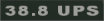
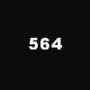
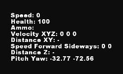
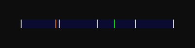
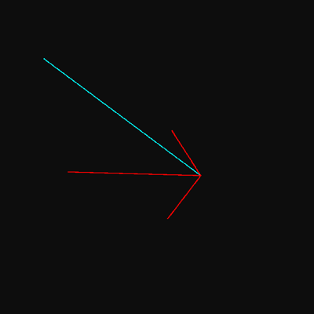
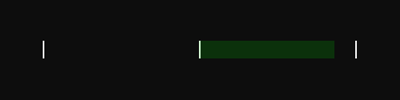
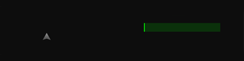
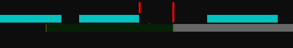

# ETJump documentation
This is official ETJump documentation. It contains [client](client/client_cvars.md) and [server](server/server_cvars.md) cvars, aswell as other useful [server](server/server_setup.md) and [mapping](mapping/mapping_entities.md) information. To get latest ETJump version visit [http://etjump.com](http://etjump.com).

## Things everyone should know

### pmove_fixed
You should always have `pmove_fixed` set to `1`. It can be simply done by typing `/pmove_fixed 1` in the console.

> __Additional information__  
> Pmove_fixed is an attempt to even out the jump height differences between different FPSes (frames per second). What it is doing is trying to simulate a stable 125 FPS. There is a small difference between a stable 125 FPS and `pmove_fixed "1"`, so you should always have `pmove_fixed` set to `1` when trickjumping.  
---
> __Warning!__  
> Don't use pmove_fixed 1 when playing other mods. It increases the bullet spread and makes it harder to hit targets!

### etj_nofatigue
You don't need to use adrenaline in ETJump thanks to this feature. Setting `etj_nofatigue 1` will give you adrenaline permanently. If you wish to do old jumps that are made to be completed without adrenaline you can turn nofatigue off by setting `etj_nofatigue 0`

### com_maxFPS
You should set `com_maxFPS` to either `43`, `76` or `125`. While the FPS doesn't affect your trickjumping when `pmove_fixed` is set to `1` it is a good idea to stabilize your frames per second. By setting `cg_drawFPS 1` you can see how well your computer performs. If your FPS is constantly over __125__, `com_maxFPS` should be set to `125`. If higher than __76__ but below __125__, it should be set to `76`. Same thing applies for `43`.

> __Additional information__  
> Setting `com_maxFPS` to `333` and `pmove_fixed` to `0` actually changes the physics slightly. Most people consider this cheating and most servers have it disabled.

### cg_fov
You can change field of view by modifying the `cg_fov` cvar. By increasing it from the default value of `90` you can see a lot more around you. It doesn't affect trickjumping in any way but most people like to change it.

## Basic features

### Position saving and loading
It is possible to save your position and later load the saved position, teleporting you back to the original saved position. To save your position, type `/save` in console. To load your saved position, type `/load` in console.

> __Binding save and load to a key__  
> You might also want to bind the save and load to keys. By doing it you no longer need to type `/save` every time you want to save. Binding save can be done by typing `/bind [key] save` in console. Load can be bound to a key by typing `/bind [key] load` in console.
---
> __Additional save slots__  
> There are three position slots in ETJump. To save a position to another slot just type `/save [slot]` to console. Possible slots are `1` and `2`. Slot `0` is the slot that is used if no slot is defined.
---
> __Loading both view angles and position__  
> If you want to load the view angles and position when you load, you need to set `etj_loadViewAngles 1`. This is on by __default__. If you want to keep aiming at the same direction as before loading, set `etj_loadViewAngles 0`.
---
> __Backup slots__  
> Incase you accidently save and overwrite an important save slot, you can load the previous slot by typing `/backup [slot]` in console. There are three backup slots `1`, `2` and `3`. __1__ is the previous saved position, __2__ is the saved position before that and so on.

### Teleporting to other players
ETJump let's you teleport to other players and teleport other players to you. Teleporting to other player is simple, just type `/goto [player name]`. The other player must enable teleportation first. Enabling can be done by typing `/nogoto` in console. The command toggles whether players can teleport to him or not.  

Teleporting other player to you can be done by typing `/call [player name]` in console. The other player must first enable call by typing `/nocall` in console. It toggles whether players can teleport him or not.

### Private messages
To send a private message, type `/m [player name] [message]` in console.

### Hiding players
ETJump automatically hides players that are close to you. This way they won't block your view. If you want to always see the players, set `/etj_hide 0`. If you want to adjust the distance when the players are hidden, it can be done with the cvar `etj_hideDistance`.

> __Additional information__  
> If you don't want other players to see you, type `etj_hideMe 1` in console.

### Keys pressed
ETJump automatically shows you the keys you press. It also shows the keys players you spectate press. This makes it easier to learn, what to press and when!

__Modifying key press HUD__

- Different keysets can be used with the `etj_drawKeys` cvar. There are __five__ different keysets available.
- Color of the keys can be modified with the `etj_keysColor` cvar.  
- Size of the keys can be modified with the `etj_keysSize` cvar.
- Position can be modified using `etj_keysX`, `etj_keysY` cvars.
- Shadow can be drawn using `etj_keysShadow` cvar.

### Speedometer
If you want to check how fast you're going or how much speed you're gaining speedometer is just for you! There are two different speedometers:

The original ETPub-like speedometer `etj_drawSpeed`.  
  

* Displaying just horizontal speed can be done by setting `/etj_speedXYonly 1`.
* Changing how often the speedometer updates can be modified with the `/etj_speedinterval` cvar.
* Changing the units can be done with the `/etj_speedunit`:

  value | Unit
  ------|------
  0     | Units per second
  1     | Miles per hour
  2     | Kilometers per hour

---
The simple one `etj_drawSpeed2`.  
  

* Position on the X/Y-axis can be modified with `etj_speedX`, `etj_speedY`.
* Size of speedometer can be modified with `etj_speedSize`.
* Color of speedometer can be modified with `etj_speedColor`.
* Color of speedometer can be made to indicate acceleration with `etj_speedColorUsesAccel`
* Transparency of speedometer can be modified with `etj_speedAlpha`.
* Text shadows can be added with `etj_speedShadow`.
* Max speed from last load session can be displayed with `etj_drawMaxSpeed`.

### Portal gun
Portal gun let's you shoot portals at walls, run into portals and get teleported to the other portal. To shoot a portal, just do `/bind KEY +attack2` where KEY is the key you want to use to shoot the second portal.

> __Additional information__  
> If you do not want to see other people's portals, turning them is simply done by typing `/etj_viewPlayerPortals 0` in console.

## Advanced features
### CHS
CHS is a feature that lets you see plenty of different interesting client related values.  
There are two different CHS positions:

* To activate the one around your crosshair, do `/etj_drawCHS1 1`.

* To activate the list-type, do `/etj_drawCHS2 1`. Alternatively, value of __2__ will align the text right for positioning it on the right side of the screen.

Each position has 8 configurable cvars, that let you see different things. Setting them is simple, just do `/etj_CHS1InfoX [VALUE]` or `/etj_CHS2InfoX [VALUE]` where __X__ is an position (__1..8__) and __"VALUE"__ is an integer from the following table.

The following list can be displayed ingame by typing `/chs`.

Value      | What it shows
-----------|--------------
1          | player's speed
2          | player's health
4          | player's ammo for currently selected weapon
10         | horizontal distance to plane
11         | vertical distance to plane
12         | true distance to plane
13         | true distance to plane from view point
14         | horizontal/vertical/true distance to plane
15         | horizontal/vertical/true(view) distance to plane
16         | world x y z location of plane
20         | speed along world x axis
21         | speed along world y axis
22         | speed along world z axis
23         | horizontal speed
24         | true speed
25         | speed relative to forward
26         | speed relative to side
27         | speed relative to forward/side
28         | horizontal speed/speed relative to forward/side
30         | player's pitch
31         | player's yaw
32         | player's roll
33         | player's X position
34         | player's Y position
35         | player's Z position
36         | view X position
37         | view Y position
38         | view Z position
40         | player's pitch/yaw
41         | player's position in the world
42         | player's position in the world and pitch/yaw
43         | view position in the world and pitch/yaw
44         | position x y z
45         | view position x y z
46         | angles x y z
47         | velocity x y z
50         | jump x y z
53         | plane angle z

### Overbounce detector
Overbounce detector shows you if you can overbounce by jumping to a certain platform. It also shows you which kind of overbounce is possible, do you need to jump or fall.

It is simple to use it, do `/etj_drawOB 1` and point at any platform.  
There are two possible overbounce types:

* __Fall overbounce__. You just need to fall from the edge instead of jumping.  
  Overbounce detector draws an __F__ next to your crosshair if the height is a fall overbounce height.
* __Jump overbounce__. You just need to jump from the edge.  
  Overbounce detector draws a __J__ next to your crosshair if the height is a jump overbounce height.

### CGaz' strafeometer
CGaz strafeometer is a tool that helps you to get correct angles when you are doing gamma jumps.
There are __five__ different CGaz' strafeometers. You can switch between them by changing the value of `etj_drawCGaz`.

* `etj_drawCGaz 1`  

* `etj_drawCGaz 2`  

* `etj_drawCGaz 3`  

* `etj_drawCGaz 4`  

* `etj_drawCGaz 5`  

__Modifying CGaz HUD__

_Note: these cvars have no effect on CGaz __2__._

* Transparency can be modified with `etj_CGazAlpha` cvar.
* Height can be modified with `etj_CGazHeight` cvar.
* Width can be modified with `etj_CGazWidth` cvar.
* Y-axis position can be modified with `etj_CGazY` cvar.

CGaz __2__ & __5__ also have some customization cvars exclusive to them.

* CGaz __2__ colors can be changed with `etj_CGazColor1` & `etj_CGazColor2`.
* CGaz __5__ colors can be changed with `etj_CGaz5Color1-4`.
* CGaz __5__ FOV can be changed with `etj_CGaz5Fov`.

### Velocity Snapping HUD

Velocity snapping HUD can be enabled with the cvar `etj_drawSnapHUD`. It lets you see the zones at which all acceleration is snapped to the same value/direction. This tool is ideally combined with `etj_drawCGaz 5`, to visualize the correct yaw angle for acceleration to occur. By keeping your crosshair in between the minimum angle (green line) of CGaz and the edge of the next snapzone, you will gain acceleration. The exact positioning of your crosshair doesn't matter - as long as the "in between" condition is met, acceleration occurs.

__Modifying SnapHUD__

* Colors can be changed with `etj_snapHUDColor1` & `etj_snapHUDColor2`.
* Height can be changed with `etj_snapHUDHeight`.
* Y-axis position can be changed with `etj_snapHUDOffsetY`.
* FOV can be changed with `etj_snapHUDFov`.

### Chat position
Moving chat location is simple. It can be done by modifying the following cvars:

* Position on the X-axis can be modified with `etj_chatPosX`.
* Position on the Y-axis can be modified with `etj_chatPosY`.
* Transparency can be modified with `etj_chatBackgroundAlpha`.
* Chat flags can be turned off with `etj_chatFlags`.
* Chat size can be scaled with `etj_chatScale`.

### HUD drawing
Some of the standard HUD elements can be easily hidden.

* Charge bar with `etj_HUD_chargeBar`.
* Fatigue bar with `etj_HUD_fatigueBar`.
* Health bar with `etj_HUD_healthBar`.
* Player's head `etj_HUD_playerHead`.
* Player's health `etj_HUD_playerHealth`.
* Weapon icon with `etj_HUD_weaponIcon`.
* XP info with `etj_HUD_xpInfo`.
* Fireteam with `etj_HUD_fireteam`.
* Popups with `etj_HUD_popup`.

### Player drawing
ETJump supports transparency effect on players. You can control transparency effect using `etj_playerOpacity` cvar. By enabling `etj_drawSimplePlayers`, players will be drawn in single color, which you can adjust with the cvar `etj_simplePlayersColor`.

### Explosive's shaking
You can adjust camera shaking from explosives using `etj_explosivesShake` cvar:

* `etj_explosivesShake 3` shake from any explosions.
* `etj_explosivesShake 2` disable cam shaking from other players explosives.
* `etj_explosivesShake 1` disable cam shaking from own explosives.
* `etj_explosivesShake 0` disable cam shaking from any explosions.

## Color system
ETJump includes an improved color parsing system for cvars that expect color values. The following formats are supported:

Format                  | Example value
------------------------|:------------------------
string                  |  white, black, green
normalized RGB(A)       |  1.0 0.5 0.75 0.33
true RGB(A)             |  255 128 191 62
hex                     |  #ff80bf, 0xff80bf

* For RGB(A) value to be considered true RGB(A), at least one value must be over __1__.
* RGB(A) values must be put inside quotes (eg. `etj_speedColor "1.0 0.0 1.0"`).

This color system will work with any ETJump or ETMain cgame cvar, with the exception of `etj_simplePlayersColor` which doesn't support setting alpha (set via `etj_playerOpacity` cvar instead).
