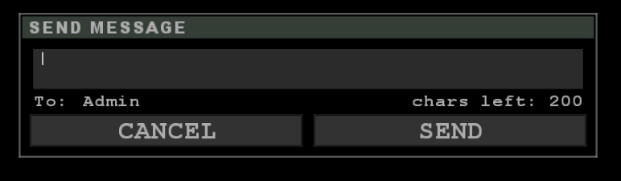

# ETJump admin system
ETJump includes a simple admin system, with configurable levels and built-in authentication system. `etkey` is completely ignored by the mod, and client identities are tied to the GUID found in `etjump/etguid.dat` instead. This file is automatically generated when connecting to a server, if it doesn't already exist.

```{important}
Keep this file safe! Never share it with others, and make sure it's backed up in case you lose it.
```

```{note}
The GUID displayed as part of [`!userinfo`](admin_system.md/#userinfo) and in the client's userinfo string is a SHA-1 hashed version of your actual GUID stored in `etguid.dat`. It is not dangerous if other players see this - it cannot be used to determine your real GUID in order to impersonate you.
```

Admins can configure the levels and their commands, as well as some other additional parameters, using the [`levels config file`](server_cvars.md/#g_levelconfig). A sample configuration file will be automatically generated by the mod when starting a server, if one isn't yet present.

User data is stored in the [`user database`](server_cvars.md/#g_userconfig). The server generates a unique ETJump ID for each new player that visits the server, and stores it in this database. It also contains any bans issued on the server, and any custom, client-specific configurations, such as greeting and title.

## Permission system

Access to admin commands is controlled by flags. The table below lists all available command flags, and the commands that they offer.

```{note}
The flags are case sensitive.
```

Flag | Commands
:----|:--------------------
\*   | all commands
/    | [`silent command execution`](admin_system.md/#silent-command-execution)
a    | [`8ball`](admin_system.md/#8ball) [`admintest`](admin_system.md/#admintest) [`findmap`](admin_system.md/#findmap) [`help`](admin_system.md/#help) [`leastplayed`](admin_system.md/#leastplayed) [`listmaps`](admin_system.md/#listmaps) [`loadcheckpoints`](admin_system.md/#loadcheckpoints) [`mapinfo`](admin_system.md/#mapinfo) [`mostplayed`](admin_system.md/#mostplayed) [`newmaps`](admin_system.md/#newmaps) [`rankings`](admin_system.md/#rankings) [`records, ranks, times and top`](admin_system.md/#ranks-records-times-and-top) [`rtv`](admin_system.md/#rtv) [`seasons`](admin_system.md/#seasons) [`spectate`](admin_system.md/#spectate)
A    | [`addlevel`](admin_system.md/#addlevel) [`deletelevel`](admin_system.md/#deletelevel) [`editcommands`](admin_system.md/#editcommands) [`editlevel`](admin_system.md/#editlevel) [`edituser`](admin_system.md/#edituser) [`finduser`](admin_system.md/#finduser) [`levelinfo`](admin_system.md/#levelinfo) [`listusernames`](admin_system.md/#listusernames) [`listflags`](admin_system.md/#listflags) [`listusers`](admin_system.md/#listusers) [`userinfo`](admin_system.md/#userinfo)
b    | [`ban`](admin_system.md/#ban) [`unban`](admin_system.md/#unban) 
c    | [`add-customvote`](admin_system.md/#add-customvote) [`delete-customvote`](admin_system.md/#delete-customvote) [`edit-customvote`](admin_system.md/#edit-customvote)
C    | [`cancelvote`](admin_system.md/#cancelvote)
f    | [`finger`](admin_system.md/#finger)
k    | [`kick`](admin_system.md/#kick)
l    | [`listplayers`](admin_system.md/#listplayers)
L    | [`listbans`](admin_system.md/#listbans)
m    | [`mute`](admin_system.md/#mute) [`unmute`](admin_system.md/#unmute)
M    | [`map`](admin_system.md/#map)
N    | [`noclip`](admin_system.md/#noclip)
P    | [`passvote`](admin_system.md/#passvote)
r    | [`restart`](admin_system.md/#restart)
R    | [`rename`](admin_system.md/#rename)
s    | [`setlevel`](admin_system.md/#setlevel)
S    | [`access to adminchat`](admin_system.md/#admin-chat)
T    | [`add-season`](admin_system.md/#add-season) [`delete-season`](admin_system.md/#delete-season) [`edit-season`](admin_system.md/#edit-season)
v    | [`moverscale`](admin_system.md/#moverscale)
V    | [`tokens`](admin_system.md/#tokens)

---

## Admin chat

Any player with the `S` command flag has access to admin chat. This is a chat system which is isolated from the rest of the chat on the server. Anyone with the flag `S` can both see and send messages to the chat.

Players can send messages to admin chat via the chat window by selecting "Admin" as the destination. If the player does not have permissions to send messages to admin chat, the message is simply dropped entirely.



```{tip}
Messages to admin chat can also be sent from console with the following commands

* [`enc_say_admin`](../client/client_commands.md/#enc_say-enc_say_team-enc_say_buddy-enc_say_admin)
* [`ma`, `say_admin`](../client/client_commands.md/#ma-say_admin)
```

```{tip}
Similar to team and fireteam chats, it's possible to create a bind that opens the chat window with "Admin" selected as destination, using the `adminChat` command. This isn't bound to anything by default.

`bind <key> adminChat`
```

An admin chat is colored orange, and prefixed with a `>`.


If desired, admin chat can be disabled on the server with the [`g_adminChat`](server_cvars.md/#g_adminchat) cvar.

---

## List of admin commands

Below you'll find a list of all the admin commands, with explanations on what they do and what flag is required to access them.

```{note}
The admin system was written a long time ago, and some of the more advanced functionality is not very well implemented. The admin system will be rewritten in the future to be more robust and better to use.
```

```{tip}
Admin commands support "auto-complete", so you don't have to type in the full name of each command. For example, `!admin` will execute `!admintest`. If you're not writing the full command, you must provide enough characters from the command that it can resolve to a single command available for your level.
```

---

### 8ball
`!8ball <question>`

8ball answers all your questions with three possible answers: yes, no and maybe.

**Flag:** a

---

### add-customvote
`!add-customvote -n <name> -fn <callvote_text> -m <maps>`  
`!add-customvote --name <name> --full-name <callvote_text> --maps <maps>`

Adds a new custom map vote list. `<maps>` is a space separated list of maps to include in the list.

**Flag:** c

```{note}
This command does not perfrom any validation on the list of maps provided, it is up to the user to provide a valid map names.
```

---

### add-season
`!add-season -n <name> -sd <YYYY-MM-DD> [-ed <YYYY-MM-DD>]`  
`!add-season --name <name> --start-date <YYYY-MM-DD> [--end-date-exclusive <YYYY-MM-DD>]`

Adds a new timerun season. If `[--end-date-exclusive]` isn't set, the season will be active until end date is added with [`!edit-season`](admin_system.md/#edit-season), or the season is deleted with [`delete-season`](admin_system.md/#delete-season).

**Flag:** T

```{note}
Season names are case insensitive.
```

---

### addlevel
`!addlevel <level> [-cmds <commands>] [-greeting <greeting>] [-title <title>]`

Adds a new level. Optionally you can use `-cmds`, `-greeting` and `-title` switches to set commands, greeting and title for the level.

**Flag:** A

---

### admintest
`!admintest`

Prints your admin level to everyone in the chat.

**Flag:** a

---

### ban
`!ban <name|clientnum> [time (seconds)] [reason]`

Bans a player. Optionally you can set a `[time]` for ban duration in seconds. No `[time]` means a permanent ban. Optionally you can also give a `[reason]` for the ban that will be printed to the banned user. Setting a `[reason]` requires setting `[time]` as well.

**Flag:** b

```{note}
Temporary bans do not currently expire during a map. If a ban timeout has expired during current map on the server, the map must be changed for the banned client to be able to connect.
```

---

### cancelvote
`!cancelvote`

Cancels currently active vote.

**Flag:** C

---

### delete-customvote
`!delete-customvote -n <name>`  
`!delete-customvote --name <name>`

Deletes a custom map vote list. Name must be an exact match.

**Flag:** c

---

### delete-season
`!delete-season -n <name>`  
`!delete-season --name <name>`

Deletes a timerun season. Name must be an exact match.

**Flag:** T

```{caution}
This will delete all timerun records associated with the season!
```

```{note}
Season names are case insensitive.
```

---

### deletelevel
`!deletelevel <level>`

Deletes a level. Users who are currently set to deleted level will be set to level 0.

**Flag:** A

---

### edit-customvote
`!edit-customvote -l <list> [-n <name>] [-fn <callvote_text>] [-am <maps>] [-rm <maps>]`  
`!edit-customvote --list <list> [--name <name>] [--full-name <callvote_text>] [--add-maps <maps>] [--remove-maps <maps>]`

Edits an existing custom map vote list.

**Flag:** c

---

### edit-season
`!edit-season -n <name> [-sd <YYYY-MM-DD>] [-ed <YYYY-MM-DD>]`  
`!edit-season --name <name> [--start-date <YYYY-MM-DD>] [--end-date <YYYY-MM-DD>]`

Edits an existing timerun season.

**Flag:** T

```{note}
Season names are case insensitive.
```

---

### editcommands
`!editcommands <level> [+command] [-command]`

Edits commands for a level. Adding a + before the command will add that command to the level, adding a - before the command will remove that command from the level. This does **not** use command flags, but rather explicit command names.

The following example adds kick and ban to level 5 and removes 8ball from the level 5

`!editcommands 5 +kick +ban -8ball`

**Flag:** A

```{todo}
Verify that this actually works as it should. It interacts weirdly with the `Commands` field in the level config.
```

---

### editlevel
`!editlevel <level> [-cmds <flags>] [-greeting <greeting>] [-title <title>] [-clear <cmds|greeting|title>]`

Edits a level with given arguments.

**Flag:** A

---

### edituser
`!edituser <etjump ID> [-cmds <flags>] [-greeting <greeting>] [-title <title>] [-clear <cmds|greeting|title>]`

Edits a user. These permissions and parameters override the regular permissions and parameters that the users' level provides.

**Flag:** A

```{tip}
This works even if the user is not connected to the server
```

---

### findmap
`!findmap <mapname> [maps per row (1-5)]`

Lists all maps on server matching `<mapname>`. If `[maps per row]` is set, will print the given amount of maps to each row (default **3**).

**Flag:** a

---

### finduser
`!finduser <name>`

Lists users that match the name.

**Flag:** A

---

### finger
`!finger <name|clientnum>`

Prints name, original name, ETJump ID, level and title of the targeted player.

**Flag:** f

---

### help
`!help [command]`

Prints all available admin commands. if `[command]` is given, prints the manual for the given command.

**Flag:** a

---

### kick
`!kick <name|clientnum> [timeout (seconds)] [reason]`

Kicks target player. If `[timeout]` is given, the targeted player is unable to connect to the server for the duration. If `[reason]` is set, the kicked client will see this message when they get kicked.

**Flag:** k

---

### leastplayed
`!leastplayed [count (1-100)]`

Lists the least played maps on the server. If `[count]` isn't specified, defaults to **10** maps.

**Flag:** a

---

### levelinfo
`!levelinfo [level]`

Lists all levels configured on the server. If `[level]` is specified, prints detailed information about the given level.

**Flag:** A

---

### listbans
`!listbans [page]`

Lists all active bans on the server. A single page fits **10** bans.

**Flag:** L

---

### listflags
`!listflags`

Lists command flags for each admin command.

**Flag:** A

---

### listmaps
`!listmaps [maps per row (1-5)]`

Lists all maps on the server. If `[maps per row]` isn't specified, defaults to **5**.

**Flag:** a

---

### listplayers
`!listplayers`

Lists all players connected to the server, including their clientnum, ETJump ID, level and name.

**Flag:** l

---

### listusernames
`!listusernames <etjump id>`

Lists all usernames registered for the given `<etjump id>` on the server.

**Flag:** A

---

### listusers
`!listusers [page]`

Lists users that are registered on servers user database. A single page fits **20** users.

**Flag:** A

---

### loadcheckpoints
`!loadcheckpoints <run name> [rank]`  
`!loadcheckpoints -r <run name> [-rk <rank>]`  
`!loadcheckpoints --run <run name> [--rank <rank>]`

Loads timerun checkpoints for comparison for given timerun. If `[rank]` isn't specified, defaults to rank 1 time. Loaded checkpoints can be cleared by specifying `-1` as rank.

**Flag:** a

```{tip}
`<run name>` supports partial name matching, the exact run name isn't required.
```

---

### map
`!map <map name>`

Changes to the specified map.

**Flag:** M

---

### mapinfo
`!mapinfo [map]`

Prints information about the current map. If `[map]` is specified, prints information about the specified map.

**Flag:** a

---

### mostplayed
`!mostplayed [count (1-100)]`

Lists the most played maps on the server. If `[count]` isn't specified, defaults to **10** maps.

**Flag:** a

---

### moverscale
`!moverscale <value (0.1-5.0)>`

Scales movement speed of entities following spline paths (typically vehicles) by the given value.

**Flag:** v

```{seealso}
[`g_moverScale`](server_cvars.md/#g_moverscale)
```

---

### mute
`!mute <name|clientnum>`

Mutes the targeted player.

**Flag:** m

---

### newmaps
`!newmaps [count (1-50)]`

Displays the latest maps added to the server, sorted from oldest to newest. If `[count]` isnt' specified, defaults to latest **5** maps.

**Flag:** a

```{note}
If a map has been on the server previously but later removed, it has already been registered to the servers map database and won't be displayed as the newest map if re-added back.
```

---

### noclip
`!noclip [name|clientnum] [count]`

Enables `noclip`. If `[name|clientnum]` is specified, targeted player can use `noclip` once. If `[count]` is specified, allows targeted player to use noclip for the given number of times. Value **-1** allows unlimited use until the targeted player disconnects.

**Flag:** N

```{note}
This command has no effect if [`g_noclip`](server_cvars.md/#g_noclip) is set to **1**.
```

---

### passvote
`!passvote`

Forces currently active vote to pass.

**Flag:** P

```{note}
Rock the Vote cannot be passed using this command.
```

---

### rankings
`!rankings [season]`  
`!rankings [-s <season>] [-p <page>] [-ps <page size>]`  
`!rankings [--season <season>] [--page <page>] [--page-size <page size>]`

Prints timerun rankings. If no parameters are given, prints top **20** overall rankings.

**Flag:** a

---

### ranks, records, times and top
`!records [run name]`  
`!records <map name> <run name>`  
`!records <season> <map name> <run name>`  
`!records [-s <season>] [-m <map name>] [-r <run name>] [-p <page>] [-ps <page size>]`  
`!records [--season <season>] [--map <map name>] [--run <run name>] [--page <page>] [--page-size <page size>]`

Prints timerun records with given parameters. If no arguments are given, prints top **3** records for each run in the current map. If `[run name]` is given, prints top **20** records for the given run. If `[season]` isn't specifed, prints overall records.

**Flag:** a

```{tip}
`<run name>`, `<map name>` and `<season>` support partial name matching.
```

```{note}
`ranks`, `reconds`, `times` and `top` are all valid aliases for this command.
```

---

### rename
`!rename <name|clientnum> <new name>`

Renames the targeted player

**Flag:** R

```{note}
This does not decrease the name change limit defined by [`g_nameChangeLimit`](server_cvars.md/#g_namechangelimit), unless you're targeting yourself.
```

---

### restart
`!restart`

Restarts the current map.

**Flag:** r

---

### rtv
`!rtv [list]`

Calls Rock the Vote. If [`list`] is given, calls Rock the Vote with maps only included in the specified custom map vote list.

**Flag:** a

---

### seasons
`!seasons`

Lists all timerun seasons on the server.

**Flag:** a

---

### setlevel
`!setlevel <name|clientnum> <level>`  
`!setlevel -id <etjump id> <level>`

Sets adminlevel of the targeted player.

**Flag:** s

```{tip}
When using `-id <etjump id>`, the targeted player does not have to be connected to the server.
``` 

---

### spectate
`!spectate [name|clientnum]`

Switches your team to spectators. If `[name|clientnum]` is specified, starts following the given player.

**Flag:** a

---

### tokens
`!tokens create <easy|e|medium|m|hard|h>`  
`!tokens delete [easy|e|medium|m|hard|h <number (1-32)>]`  
`!tokens move`

Creates, deletes or moves a collectible token with given arguments.

* `!tokens create` will create a token to your location with the given difficulty.
* `!tokens delete` will delete a token closest to your location, or a specific token from given difficulty.
* `!tokens move` will move the token closest to you to your current location.

**Flag:** V

```{note}
[`g_tokensMode`](server_cvars.md/#g_tokensmode) must be set to **1** for these commands to work.
```

---

### unban
`!unban <ban id>`

Removes a ban with the given `<ban id>`.

**Flag:** b

```{note}
The unbanned player won't be able to connect to the server until the next time the map is changed.
```

---

### unmute
`!unmute <name|clientnum>`

Unmutes the targeted player.

**Flag:** m

---

### userinfo
`!userinfo <etjump id>`

Prints information about the given user.

**Flag:** A

---

### Silent command execution
`/!command`

Allows clients to execute any admin commands available to them silently, without having the typed command appear in chat.

**Flag:** /

```{note}
Silent commands must be typed in console instead of chat. Any output that a command might produce for other players will still be visible.
```
