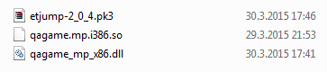
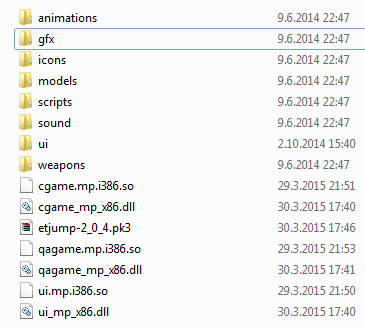

# Setting up an ETJump server
Here you will find simple instructions on how to set up ETJump server on windows and linux machines.

## Setting up a server on Windows
Setting up an ETJump server on Windows is simple. Start by downloading latest version of ETJump from [http://etjump.com](http://etjump.com). After you've downloaded ETJump zip, create a directory in the ET installation root and name it etjump. If you call it something else, the server will force everyone to download the mod files, even if they have them in their own etjump directory. Unpack zip files in the etjump directory.

Below is a picture of the directory structure you should get.  

Now you can start the server by running the following command `ETDED.exe +set fs_game etjump +map oasis`. You can either run the command from the command line or you can create a shortcut to the ETDED.exe and add `+set fs_game "etjump" +map oasis` as additional parameters.

If you wish to play on the server with the same ET installation as the server is, you must first unpack the etjump .pk3 file into the same directory. To do this, open etjump .pk3 with any software that can open .zip files and extract the contents to the same directory. After you've done this, the directory should look like the following.  

## Setting up a server on Linux
Setting up a server on Linux is simple. Download the latest version of ETJump from [http://etjump.com](http://etjump.com). Once you're done, create etjump directory in your ET installation directory. Unzip the contents of the downloaded zip to that directory. Start `ETDED` and set mod to etjump with the `+set fs_game etjump` parameter.